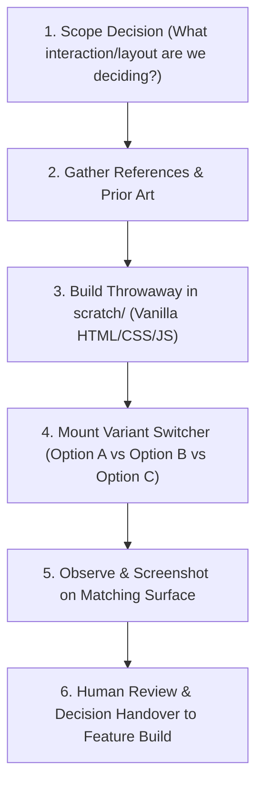

# Prototype Spike

## Overview

When a novel interaction, visual hierarchy, or architectural workflow has no established precedent in the codebase, building the wrong feature in production code is vastly more expensive than exploring competing sketches up front.

`prototype-spike` operationalizes the **"Exhaust the Design Space"** and **"Experience First"** principles:
- **Design decisions are cheaper in throwaway HTML than production code.**
- **Never accept the first shape the model thought of.**
- **You own the design decision, not the throwaway code.**

---

## When to Use

- When designing a novel UI layout, navigation model, or information density where tactile feel and usability matter more than formal logic.
- When debating 2–3 competing approaches to a user workflow (e.g., modal dialog vs. slide-out drawer vs. inline accordion).
- When validating timing, animation, or reactive state transitions before touching production frameworks or stores.

## When NOT to Use

- For mechanical feature implementations where the architectural pattern is already established.
- For bug fixes, performance tuning, or refactoring within existing contracts.
- When rigid external constraints dictate a single viable approach.

---

## The Prototyping Rules

1. **Strict Scratch Isolation**:
   Prototypes MUST be built in an isolated scratch directory (`<appDataDir>/scratch/prototypes/<name>/` or `scratch/prototypes/`), completely separate from production source trees.
2. **Zero Production Overhead**:
   No production build systems, no heavy framework boilerplate, no unit tests, and no production state stores. Use vanilla HTML/CSS/JavaScript or the lightest static setup with hot reload.
3. **The Variant Switcher**:
   When exploring alternatives, implement 2–3 competing approaches behind a single on-screen switcher bar (or keyboard shortcut). Each variant must be clearly labeled (`Option A: Unified Table`, `Option B: Tabbed Matrix`, `Option C: Modal Wizard`).
4. **Observation Over Assertions**:
   The test of a prototype is human or agent observation (clicking through, checking responsiveness, capturing screenshots across viewports), not unit assertions.
5. **Throwaway Contract**:
   The prototype is a disposable decision instrument. Once the decision is made, discard the scratch code. Hand the chosen specification and design tokens to the appropriate feature playbook for real implementation.

---

## Workflow

### Step 1: Scope the Decision
Explicitly state the exact question the prototype exists to answer:
- *"Does switching drive parameters between Homing and Profile modes feel natural as a single unified table or as tabbed sheets?"*
- *"Does a bottom-pinned commit bar displace critical table rows on 800px touchscreens?"*
If there is no open design decision, stop: do not build a prototype; proceed directly to feature planning.

### Step 2: Gather References
Summarize prior art, design token references, and moodboards. Identify 2–3 distinct variations that explore different trade-offs in density, hierarchy, and affordance.

### Step 3: Build Throwaway Prototype
In scratch space, create a minimal self-contained application:
- `index.html`: Layout with variant switcher buttons.
- `style.css`: Clean, token-aligned styles reproducing the interface character.
- `app.js`: Minimal reactive state to toggle between variants.

### Step 4: Drive and Capture Evidence
Launch a local static server, drive the prototype through the browser, and capture visual screenshots of each variant under realistic viewport constraints (e.g., 1080p desktop, 800px industrial panel).

### Step 5: Deliver Recommendation
Present the options to the operator:
- Visual screenshots comparing Variant A, B, and C side-by-side.
- Trade-offs for each option (cognitive load, click depth, viewport economy).
- Concrete architectural recommendation.
- Confirmation that the prototype is disposable scratch code.
