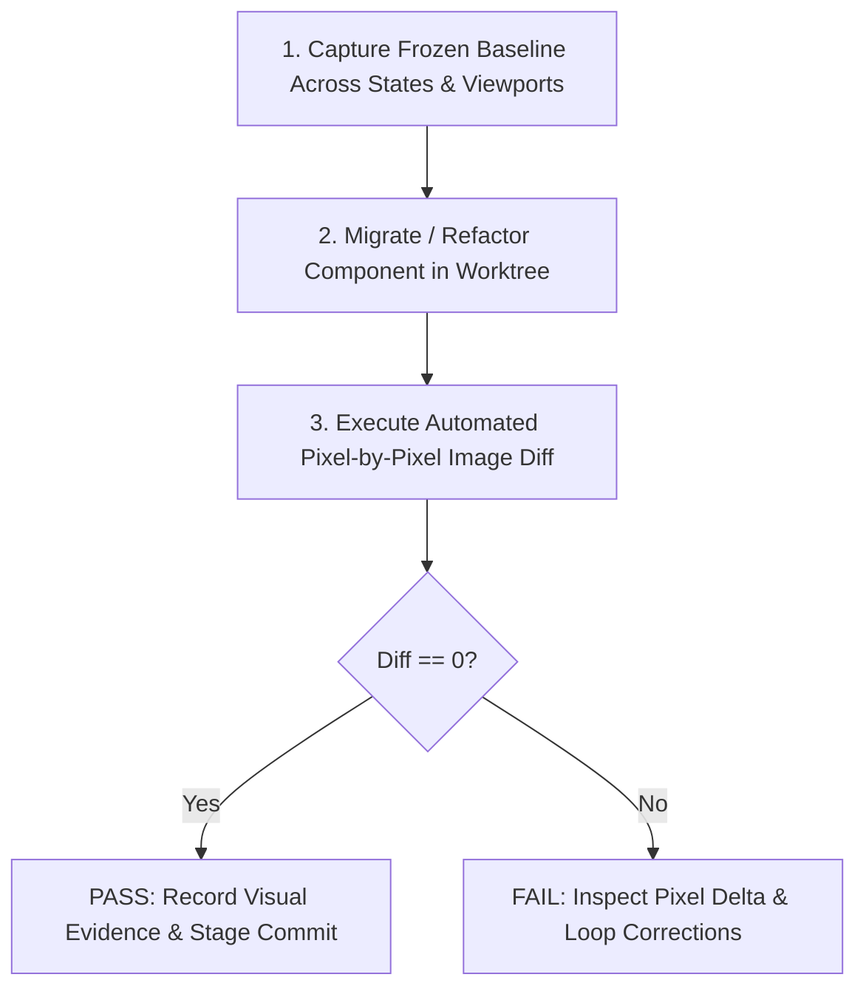

# Visual Parity

## Overview

When refactoring user interface components, modernizing styling systems, or migrating legacy UI frameworks, subjective human inspection and mock-based unit tests are insufficient to guarantee visual fidelity.

`visual-parity` enforces **pixel-exact equivalence**:
- **You own pixel-exact equivalence. The baseline is the specification.**
- **Equivalence is verified by automated image diff, not by human eye.**
- **A non-zero pixel difference is a failure until investigated and justified.**

---

## When to Use

- When refactoring or modernizing existing UI components without changing their intended visual design.
- When migrating styles (e.g., migrating from vanilla CSS to design tokens, or replacing legacy CSS with modern layout primitives).
- When reimplementing components in a new framework or runtime (e.g., React component rewrite, Web Components migration) while preserving exact visual appearance.

## When NOT to Use

- When intentionally redesigning a screen or altering user experience flows.
- For backend services, headless APIs, or CLI tools without a rendered graphical surface.

---

## The Non-Negotiable Invariants

1. **Baseline First**:
   Establish and freeze the baseline visual regression harness and golden screenshots across all component states *before* touching a single line of production code. No baseline = no parity claim.
2. **Anti-Shortcut Clauses**:
   - Zero tolerance for baseline tampering or threshold manipulation.
   - Never alter the visual test harness or restructure components merely to force an image diff to pass.
   - If the baseline reveals an existing bug or flaw, stop and consult the operator; do not silently rewrite the baseline.
3. **Automated Image Diff on Real Matching Surface**:
   Visual diffs must execute in real browser engines (Chromium/Firefox via Playwright or CDP), capturing full-page and element-level screenshots at fixed viewports and device pixel ratios.

---

## Workflow



### Step 1: Establish Frozen Baseline
Before making code changes, run the test harness to generate reference screenshots across all permutations:
- Primary states: Default, Hover, Active, Focused, Disabled.
- Data states: Empty, Loaded, Overflow/Truncated, Error.
- Viewports: Standard desktop (e.g., 1440x900) and constrained/touch display (e.g., 800x600).
Store these golden images in `fixtures/baselines/<component>/`.

### Step 2: Implement Refactoring in Isolation
Refactor the target component in an isolated worktree or branch. Keep changes focused strictly on structure, performance, or styling cleanup without accidental layout drift.

### Step 3: Run Automated Image Diff
Execute visual regression testing (e.g., using Playwright's `expect(page).toHaveScreenshot()`):
```javascript
await expect(page.locator('.component-target')).toHaveScreenshot('component-baseline.png', {
  maxDiffPixels: 0,
  animations: 'disabled'
});
```

### Step 4: Investigate Pixel Deltas
If a diff is non-zero:
1. Examine the generated visual diff image (highlighting mismatched pixels in magenta/red).
2. Trace the discrepancy to font rendering, subpixel anti-aliasing, margin collapsing, or box-sizing changes.
3. Correct the component implementation and re-test until the diff is 0.

### Step 5: Document and Deliver Evidence
Include the before/after/diff screenshot composite in the execution report as definitive proof of visual preservation.
