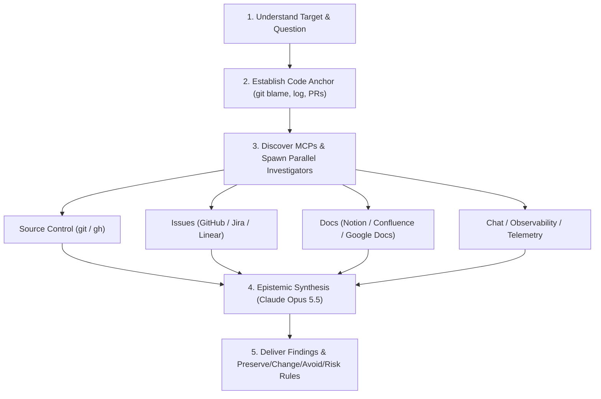

# Why (Historical Intent & Code Archaeology)

## Overview

Investigate the motivation, constraints, and historical intent behind existing code.

Companion to the `how` skill:
- **`how`** answers *what* the system does and *how* it works at runtime.
- **`why`** answers *what forces* led to its shape.

### The Core Philosophy: Chesterton's Fence

> *"Do not take a fence down until you know why it was put up."*

**Code does not carry its own motivation.** You can read what code does; you cannot read *why it exists*. Intent lives scattered across commits, pull request discussions, issue trackers, design docs, team chat, and postmortems. Pretending otherwise produces confident-sounding guesses that mislead engineers and cause regressions.

`why` enforces strict epistemic discipline, classifying every finding into 5 objective confidence tiers, resisting the sycophancy trap, and forbidding post-hoc rationalization.

---

## When to Use

- When planning to refactor, delete, or rewrite existing code or subsystem boundaries.
- Before authoring Architecture Decision Records (ADRs) in `docs/decisions/` that alter established invariants.
- When investigating regressions, surprising constants, rate limits, or retry thresholds.
- When evaluating whether defensive code (null checks, timeouts, fallback branches) is still required or reflects a past incident.
- When running an exploratory spike in Playbook 6 (`PB-6: Investigation Spike`).

### When NOT to Use

- When asking for runtime call flow, package placement, or subsystem architecture; use `how`.
- When reviewing a recent bounded pull request or branch diff; use `walkthrough-me`.
- When auditing code solely for vestigial configurations or dead parameters; use `audit-vestigial-contracts`.

---

## Model Architecture & Roles

This skill coordinates parallel source investigators with an authoritative epistemic synthesizer:

- **Investigators (Parallel Category Gathering)**:
  - Fast, tool-capable subagents specialized in deep query sweeps across single evidence categories.
  - Runtime: Antigravity native subagent (`invoke_subagent` with `Role: "Archaeology Investigator"`, `Model: "flash"` or `inherit`) or Pi Copilot (`grok-4.7`).
- **Synthesizer (Epistemic Synthesis & Spot-Checking)**:
  - High-rigor frontier model specialized in historical analysis, epistemic calibration, and citation spot-checking.
  - Runtime: Configured in `roles.investigation` in `~/.config/thinker/config.yaml` (default: **Claude Opus 5.5** via Claude Code CLI runner: `claude -p --model opus` or native Antigravity `Model: "pro"`).

---

## Workflow



### Step 1. Understand the Target and Question

Parse what the operator is asking:
- **Target**: Specific file path, symbol, function, or structural pattern.
- **Question**: Design rationale, tradeoff, edge-case motivation, origin of magic constants, or history sweep.

State your working interpretation concisely before launching queries.

### Step 2. Establish the Code Anchor

Anchor the investigation in concrete repository metadata:
```bash
# Blame target lines for last-touch commits
git blame -L <start>,<end> <file>

# Full file history with patches through renames
git log --follow -p -L <start>,<end>:<file>

# Recent commits touching the file, highlighting PR numbers
git log --oneline -20 -- <file>

# Inspect PR bodies, discussions, and linked issues via gh
gh pr view <number> --json title,body,author,createdAt,mergedAt,labels,closingIssuesReferences,comments,reviews
```

Extract the anchor seed: file paths, line ranges, symbols, commit hashes, PR numbers, and referenced ticket IDs.

### Step 3. Discover Available Sources & Spawn Parallel Investigators

Map the environment's available MCPs and tools across the **7 evidence categories**:
1. **Source control history** (`git`, `gh` PR discussions, code reviews). *Always available.*
2. **Issue / ticket tracker** (Linear, Jira, GitHub Issues).
3. **Long-form documents** (Notion, Confluence, Google Docs).
4. **Real-time team chat** (Slack, Discord, Teams).
5. **Infrastructure observability** (Datadog, Honeycomb, Grafana).
6. **Error / exception tracking** (Sentry, Bugsnag).
7. **Product analytics warehouse** (BigQuery, Snowflake, Databricks).

Spawn parallel investigators (one per available evidence category):
- Each investigator receives `references/investigator-prompt.md`, the matching source playbook from `references/sources/`, and the code anchor.
- If the target code looks defensive (null guards, timeouts, retries, rate limits), also attach `references/sources/incident-postmortem.md`.
- Record any unavailable sources explicitly in the coverage map rather than silently omitting them.

### Step 4. Synthesize with Epistemic Discipline

Invoke the synthesizer (Claude Opus 5.5 via `claude -p --model opus` or Antigravity `pro`) with all gathered findings and `references/synthesizer-prompt.md`.

The synthesizer enforces the **Epistemics Framework (`references/epistemics.md`)**:
- **Confidence Calibration**: Every claim is assigned to one of the 5 tiers:
  - `[Direct]`: Explicit author citation (*"fixes bug where >1000 items fail to paginate"*).
  - `[Supported]`: Multiple indirect signals converge (PR title, tests, and commit messages align).
  - `[Inferred]`: Reasonable derivation, phrased cautiously (*"appears to"*, *"is consistent with"*).
  - `[Speculative]`: Plausible hypothesis with thin evidence; explicitly labeled as a guess.
  - `[Unknown]`: Explicitly documented gaps where queries yielded no record.
- **Spot-Check Citations**: Verify that cited PRs, commits, and comments actually say what was reported.
- **No Sycophancy**: If the user asked *"Why do we do X, is it for perf?"*, treat performance as an unproven hypothesis to test, not a truth to validate.
- **No Rationalization**: Do not invent tidy reasons for messy or historical accidents.

### Step 5. Present & Deliver Constraint Set

Present the structured output:
1. **The Question & The Code Anchor**
2. **What We Found (`[Direct]` / `[Supported]`)**
3. **What We Can Reasonably Infer (`[Inferred]`)**
4. **Competing Hypotheses** (if multiple explanations fit)
5. **What We Don't Know** (documented query gaps)
6. **Sources Consulted** (one line per evidence category)
7. **Actionable Constraint Set**:
   - **PRESERVE**: Invariants and edge cases that MUST NOT be broken.
   - **CHANGE**: Outdated assumptions safe to remove.
   - **AVOID**: Known failure modes discovered during archaeology.
   - **RISKS**: Remaining unknowns requiring canary tests or operator confirmation.

---

## Reference Files

- `references/epistemics.md`: Confidence tiers, phrasing rules, and anti-rationalization guidelines.
- `references/investigator-prompt.md`: Base prompt for parallel category investigators.
- `references/synthesizer-prompt.md`: Prompt template for Claude Opus 5.5 synthesis.
- `references/source-playbook.md`: Index of category playbooks (`references/sources/*.md`).
