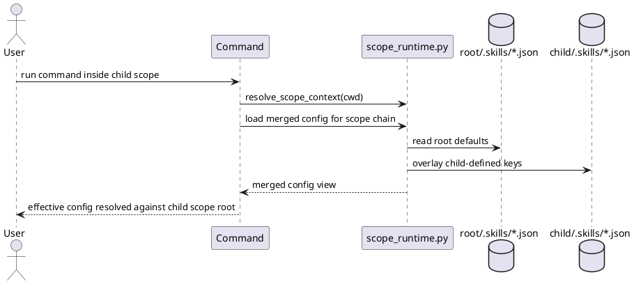

# Implementation Plan: Merge parent and child .skills config by scope

**Slice**: `hss-config-inheritance-merge-parent-and-child-skills-config-by-scope`  
**Date**: 2026-04-03  
**Status**: Reviewed
**Spec**: `brief.md`

## 1. Summary

HSS-06 config inheritance adds a merged config view across the active scope
chain. Parent scopes provide defaults for planning, execution, and conventions
config, while child scopes override only the keys they define. Inherited
relative paths still resolve against the active scope root.

The slice covers merged config loading and consumption, not execution-local slice
placement. Scope-local execution registries remain the next slice.

## 2. Technical Context

- Current system context:
  - planning and proposal helpers already resolve one active scope but still load
    only that scope's planning config
  - execution and conventions loaders in `guide-execution` still read one local
    config file directly
  - bootstrap preserves unknown keys when rewriting one config file but does not
    yet read parent scope config as part of the effective view
- Target modules / files:
  - `skills/guide-planning/scripts/scope_runtime.py`
  - `skills/guide-planning/scripts/manage_planning.py`
  - `skills/propose/scripts/manage_proposals.py`
  - `skills/guide-execution/scripts/manage_execution.py`
  - `skills/bootstrap/scripts/bootstrap.py`
  - `skills/bootstrap/tests/test_bootstrap.py`
  - `skills/guide-planning/tests/test_manage_planning.py`
  - `skills/propose/tests/test_manage_proposals.py`
  - `skills/guide-execution/tests/test_manage_execution.py`
- Constraints:
  - merge configs from outer scope to inner scope with child override precedence
  - preserve unknown keys
  - resolve inherited relative paths against the active scope root
  - do not yet move execution registries or slices into scope-local directories
- Assumptions:
  - explicit scopes are represented by local `.skills/planning.json` for current
    scope discovery, with execution/conventions optionally present alongside it
  - merged config views can be computed in the shared scope runtime and consumed
    by downstream helpers without changing their external command surfaces
- Out of scope:
  - scope-local slice registry placement
  - guide-scope routing
  - new ambiguity behavior beyond what HSS-04 already established

## 3. Planning Gates

### Architecture / Constraints

- Decision: extend the shared scope runtime with scope-chain and merged-config
  helpers, then have config consumers read that merged view.
- Result: PASS
- Notes: centralizing merge behavior in the runtime avoids drifting precedence
  rules across planning, proposal, bootstrap, and execution helpers.

### Risk / Compliance

- Decision: keep merges additive and key-based, preserving unknown keys and only
  overlaying child-defined values.
- Result: PASS
- Notes: the main risk is silently reinterpreting inherited relative paths
  against the wrong directory, so tests must assert active-scope path resolution.

### Testability

- Decision: add focused tests for parent/child merges, inherited relative paths,
  and execution/conventions reads; then run the repo suite.
- Result: PASS
- Notes: the slice is only complete when both planning/proposal and
  execution/bootstrap consumers read the same merged config semantics.

## 4. Requirement Traceability

| Requirement | Implementation Steps | Validation |
| --- | --- | --- |
| FR-001 | S001, S002, S003 | V001, V002, V003 |
| FR-002 | S001, S002 | V001, V002 |
| FR-003 | S001, S002, S003 | V001, V002, V003 |
| FR-004 | S002, S003, S004 | V001, V002, V003 |
| FR-005 | S003, S004 | V002, V003 |

## 5. Execution Plan

### Packet P01: Shared merged-config runtime

- Scope: add scope-chain and merged-config helpers to the shared runtime.
- Target files:
  - `skills/guide-planning/scripts/scope_runtime.py`
- Dependencies: hss-promotion-targeting
- Steps:
- [x] S001 Extend `ScopeContext` with scope-chain metadata and add shared
        helpers that merge planning, execution, and conventions config from outer
        scope to inner scope while preserving unknown keys.
- Validation:
  - [x] V001 `pytest -q skills/guide-planning/tests/test_manage_planning.py skills/propose/tests/test_manage_proposals.py`
- Definition of Done: one shared runtime can produce merged config views for the
  active scope chain.
- Rollback / Mitigation: keep the merged-config helpers additive and revert
  consumers to single-scope reads only if the shared precedence rules are wrong.

### Packet P02: Config consumer integration

- Scope: move planning, proposal, execution, and bootstrap config consumers onto
  the merged-config runtime.
- Target files:
  - `skills/guide-planning/scripts/manage_planning.py`
  - `skills/propose/scripts/manage_proposals.py`
  - `skills/guide-execution/scripts/manage_execution.py`
  - `skills/bootstrap/scripts/bootstrap.py`
  - `skills/bootstrap/tests/test_bootstrap.py`
  - `skills/guide-planning/tests/test_manage_planning.py`
  - `skills/propose/tests/test_manage_proposals.py`
  - `skills/guide-execution/tests/test_manage_execution.py`
- Dependencies: P01
- Steps:
  - [x] S002 Update planning and proposal config loaders to read merged planning
        config while resolving inherited relative paths against the active scope.
  - [x] S003 Update execution and conventions loaders to read merged execution
        and conventions config without yet changing slice registry placement.
  - [x] S004 Add regression tests for parent/child overrides, unknown-key
        preservation, and inherited relative path resolution.
- Validation:
  - [x] V002 `pytest -q skills/bootstrap/tests/test_bootstrap.py skills/guide-planning/tests/test_manage_planning.py skills/propose/tests/test_manage_proposals.py skills/guide-execution/tests/test_manage_execution.py`
  - [x] V003 `pytest -q`
- Definition of Done: child scopes can inherit parent config defaults and
  override only the keys they define across the planning, proposal, bootstrap,
  and execution config readers touched by this slice.
- Rollback / Mitigation: keep execution-local registry movement out of scope and
  confine fixes to merged reads so hss-scoped-execution can build on a stable
  config layer.

## 6. Supporting Notes

### Detailed Design Diagrams (PlantUML)

- Diagram purpose: show parent-to-child config merging with active-scope path
  resolution.
- Diagram type: sequence

### Research Decisions

- Decision: treat config inheritance as a shared runtime concern rather than
  separate per-command merge logic.
- Rationale: the same precedence and path-resolution rules must hold across
  planning, proposal, bootstrap, and execution helpers.
- Alternative considered: defer all config work until scoped execution; rejected
  because execution-local slice placement needs a stable merged config layer
  first.

### Interface Notes

- Interface: merged config readers in the shared scope runtime
- Inputs / outputs:
  - input: active `ScopeContext`
  - output: merged planning, execution, and conventions config views
- Error states / compatibility notes:
  - missing child config files inherit from parent scopes
  - relative directories still resolve against the active scope root
  - execution-local slice placement remains deferred

### Verification Scenarios

- Happy path:
  - child scope overrides one key and inherits the rest from the parent
- Edge case:
  - an inherited relative path still resolves under the child scope root
- Regression checks:
  - ambiguity handling and promotion targeting from HSS-04 remain unchanged
  - full `pytest -q` remains green

## 7. Delivery Notes

- Sequencing rationale: land merged config loading before any scope-local
  execution registry movement.
- Risks to monitor: dropping unknown keys during merges, or resolving inherited
  relative paths against the parent definition scope instead of the active child
  scope.
- Handoff notes for implementation: keep execution-local registry writes out of
  this slice even if the merged execution config now exposes a child override for
  `slice_dir`.

## 8. Execution Review Outcome

- Outcome: ready for `close-slice`
- Review classification:
  - brief-to-implementation gap: none
  - intent-to-brief gap: none
  - follow-up outside the active slice: none
- Durable artifact note:
  - HSS-06 now centralizes parent-to-child config merging in the shared scope
    runtime, switches planning and proposal helpers to merged planning config,
    adds scope-aware merged execution and conventions loaders, and teaches
    bootstrap to seed child configs from inherited parent values before applying
    local overrides.
- Validation evidence:
  - `pytest -q skills/bootstrap/tests/test_bootstrap.py skills/guide-planning/tests/test_manage_planning.py skills/propose/tests/test_manage_proposals.py skills/guide-execution/tests/test_manage_execution.py`
  - `pytest -q`
