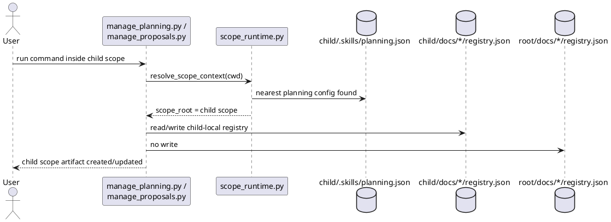

# Implementation Plan: Keep planning and proposal registries local to each scope

**Slice**: `hss-local-registries-keep-planning-and-proposal-registries-local-to-each-scope`  
**Date**: 2026-04-03  
**Status**: Reviewed for close-slice
**Spec**: `brief.md`

## 1. Summary

HSS-02 hardens explicit child-scope ownership for planning and proposal
artifacts. A nested scope that declares its own `.skills/planning.json` should
create and update its own `docs/features/` and `docs/proposals/` registries and
metadata without mutating the repository-root registries.

The implementation is expected to be small because HSS-01 already introduced a
shared scope runtime. This slice mainly proves and locks in the local-registry
contract with child-scope regression tests, plus any narrow helper fixes those
tests expose.

## 2. Technical Context

- Current system context:
  - `skills/guide-planning/scripts/scope_runtime.py` already resolves the nearest
    `.skills/planning.json` and falls back to the repository root when none is
    found.
  - `manage_planning.py` and `manage_proposals.py` already resolve configured
    `planning_dir` and `proposal_dir` relative to the resolved scope root and
    keep registry row paths relative.
  - Existing tests only prove repository-root fallback from nested directories;
    they do not yet prove child-scope registry isolation.
- Target modules / files:
  - `skills/guide-planning/tests/test_manage_planning.py`
  - `skills/propose/tests/test_manage_proposals.py`
  - `skills/guide-planning/scripts/manage_planning.py` if explicit child-scope
    tests reveal path or lookup drift
  - `skills/propose/scripts/manage_proposals.py` if explicit child-scope tests
    reveal path or lookup drift
- Constraints:
  - keep HSS-02 focused on explicit child-scope ownership semantics
  - do not introduce `--scope`, `--target-scope`, ambiguity handling, or config
    inheritance in this slice
  - preserve repository-root fallback behavior validated by HSS-01
- Assumptions:
  - an explicit child scope for this slice is represented by its own
    `.skills/planning.json`
  - child and root scopes may use the same relative `planning_dir` and
    `proposal_dir` names but must resolve them against different scope roots
- Out of scope:
  - nearest-scope defaulting from arbitrary subdirectories without an explicit
    child `.skills/planning.json`
  - cross-scope lookup behavior
  - scope-local execution registries and slice bootstrap

## 3. Planning Gates

### Architecture / Constraints

- Decision: treat HSS-02 as local-registry ownership hardening on top of the
  HSS-01 runtime instead of adding a second scope-discovery mechanism.
- Result: PASS
- Notes: this keeps the slice bounded to independent planning/proposal state and
  avoids pulling in HSS-03 or HSS-06 behavior early.

### Risk / Compliance

- Decision: validate isolation explicitly by asserting root registries stay
  unchanged when child-scope work is created.
- Result: PASS
- Notes: the main risk is silent writes drifting into the wrong scope, so the
  tests must assert both the positive child-scope writes and the negative
  root-scope non-writes.

### Testability

- Decision: add explicit child-scope tests for both planning and proposal flows,
  then run the targeted suites and the full repo regression suite.
- Result: PASS
- Notes: every requirement maps to concrete pytest scenarios that inspect both
  child and root registries.

## 4. Requirement Traceability

| Requirement | Implementation Steps | Validation |
| --- | --- | --- |
| FR-001 | S001, S002 | V001, V003 |
| FR-002 | S001, S003 | V002, V003 |
| FR-003 | S001, S002, S003 | V001, V002 |
| FR-004 | S002, S003 | V001, V002, V003 |
| FR-005 | S001, S002, S003 | V001, V002, V003 |

## 5. Execution Plan

### Packet P01: Planning child-scope isolation

- Scope: prove that planning helpers create and update features in the child
  scope registry when a child `.skills/planning.json` exists.
- Target files:
  - `skills/guide-planning/tests/test_manage_planning.py`
  - `skills/guide-planning/scripts/manage_planning.py` if fixes are required
- Dependencies: hss-root-fallback
- Steps:
  - [ ] S001 Add test fixtures that create separate root and child scope planning
        configs using the same relative `docs/features` path.
  - [ ] S002 Add planning regression coverage showing child-scope feature work
        creates child-local registry entries and leaves the root registry
        unchanged.
- Validation:
  - [ ] V001 `pytest -q skills/guide-planning/tests/test_manage_planning.py`
- Definition of Done: planning helpers consistently write feature metadata and
  registry entries into the active child scope when that scope defines its own
  planning config.
- Rollback / Mitigation: if the child-scope path logic is unstable, keep the new
  tests and tighten scope-path resolution in `manage_planning.py` without
  expanding into later-slice CLI behavior.

### Packet P02: Proposal child-scope isolation

- Scope: prove the same local-ownership contract for proposal helpers and align
  implementation if tests expose drift.
- Target files:
  - `skills/propose/tests/test_manage_proposals.py`
  - `skills/propose/scripts/manage_proposals.py` if fixes are required
- Dependencies: P01
- Steps:
  - [ ] S003 Add proposal regression coverage showing child-scope proposal work
        initializes and updates child-local proposal registries while the root
        proposal registry stays unchanged.
- Validation:
  - [ ] V002 `pytest -q skills/propose/tests/test_manage_proposals.py`
  - [ ] V003 `pytest -q`
- Definition of Done: proposal helpers match planning child-scope ownership and
  the repo suite stays green.
- Rollback / Mitigation: if proposal behavior diverges unexpectedly, fix only the
  scope-local registry ownership path and defer any broader lookup semantics to
  HSS-03/HSS-04.

## 6. Supporting Notes

### Detailed Design Diagrams (PlantUML)

- Diagram purpose: show how explicit child-scope config selects child-local
  registries instead of the repository-root registries.
- Diagram type: sequence

### Research Decisions

- Decision: implement HSS-02 primarily as child-scope regression coverage.
- Rationale: HSS-01 already introduced the reusable scope-path behavior; this
  slice should lock in the explicit child-scope contract instead of duplicating
  architecture work.
- Alternative considered: move immediately to `--scope`-aware CLI behavior;
  rejected because that is HSS-03/HSS-04 scope.

### Interface Notes

- Interface: planning/proposal scope resolution
- Inputs / outputs:
  - input: current working directory inside a child scope with its own
    `.skills/planning.json`
  - output: feature/proposal registries and metadata rooted at that child scope
- Error states / compatibility notes:
  - repository-root fallback remains valid when no child scope config exists
  - this slice does not define cross-scope lookup or ambiguity behavior

### Verification Scenarios

- Happy path:
  - create a feature and a proposal from inside a child scope and confirm the
    corresponding child-local registries and metadata are created
- Edge case:
  - assert the root registries do not gain the child-scope slug while the child
    scope work is created
- Regression checks:
  - existing repository-root fallback tests still pass
  - full `pytest -q` remains green

## 7. Delivery Notes

- Sequencing rationale: lock down local registry ownership before introducing
  nearest-scope defaults, ambiguity handling, or config inheritance.
- Risks to monitor: tests that accidentally rely on current working directory
  instead of an explicit child scope, or helpers that compare only relative paths
  without proving root registries stay untouched.
- Handoff notes for implementation: prefer proving the intended child-scope
  contract with focused regression tests first; only change helper code if those
  tests expose a real ownership bug.

## 8. Execution Review Outcome

- Outcome: ready for `close-slice`
- Review classification:
  - brief-to-implementation gap: none
  - intent-to-brief gap: none
  - follow-up outside the active slice: none
- Durable artifact note:
  - HSS-02 landed as explicit child-scope regression coverage in
    `test_manage_planning.py` and `test_manage_proposals.py`; the HSS-01 runtime
    behavior already satisfied the slice without additional helper changes
- Validation evidence:
  - `pytest -q skills/guide-planning/tests/test_manage_planning.py skills/propose/tests/test_manage_proposals.py`
  - `pytest -q`
