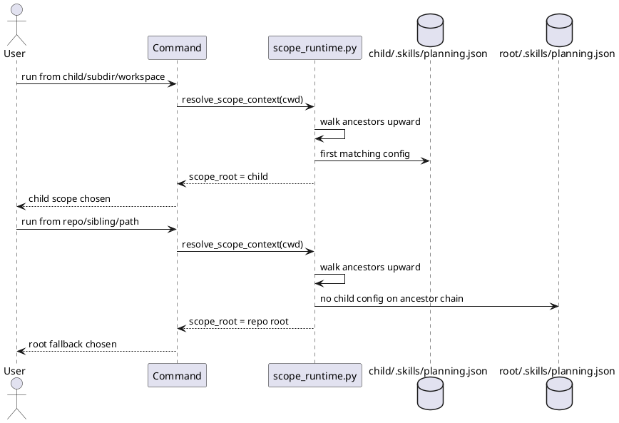

# Implementation Plan: Default CLI operations to the nearest enclosing scope

**Slice**: `hss-nearest-scope-default-cli-operations-to-the-nearest-enclosing-scope`  
**Date**: 2026-04-03  
**Status**: Reviewed for close-slice
**Spec**: `brief.md`

## 1. Summary

HSS-03 proves that planning and proposal commands resolve the **nearest
enclosing** explicit scope from the current working directory. Work run from a
directory inside a child scope should use that child scope's registries, while
work run elsewhere in the repository should still fall back to the repository
root.

As with HSS-02, the implementation is expected to be narrow because the shared
scope runtime already walks ancestor directories. The slice should land as
focused regression coverage plus any small resolver fixes exposed by those new
tests.

## 2. Technical Context

- Current system context:
  - `scope_runtime.py` resolves the nearest ancestor containing
    `.skills/planning.json`, then falls back to the repository root.
  - Existing tests prove repository-root fallback and explicit child-scope
    ownership, but they do not yet prove behavior from directories nested below a
    child scope root or from repo paths outside that child subtree.
- Target modules / files:
  - `skills/guide-planning/tests/test_manage_planning.py`
  - `skills/propose/tests/test_manage_proposals.py`
  - `skills/guide-planning/scripts/scope_runtime.py` if deeper nested tests
    expose resolver drift
  - `skills/guide-planning/scripts/manage_planning.py` and
    `skills/propose/scripts/manage_proposals.py` only if path resolution still
    leaks to the wrong scope
- Constraints:
  - keep the slice focused on default nearest-enclosing resolution
  - do not add `--scope`, ambiguity handling, explicit cross-scope targeting, or
    config inheritance here
  - preserve both HSS-01 root fallback and HSS-02 child-scope isolation
- Assumptions:
  - explicit scopes are still represented by local `.skills/planning.json`
  - commands may run from arbitrarily deep subdirectories inside a child scope
- Out of scope:
  - explicit scope flags
  - ambiguous multi-scope selection UX
  - cross-scope promotion behavior
  - execution-layer scope handling

## 3. Planning Gates

### Architecture / Constraints

- Decision: validate the existing ancestor-walk runtime against deeper nested
  working directories before changing the resolver.
- Result: PASS
- Notes: this keeps HSS-03 bounded to behavior that should already exist and
  avoids re-architecting the scope runtime prematurely.

### Risk / Compliance

- Decision: assert both positive child-scope routing and negative root-fallback
  routing in the same test fixtures.
- Result: PASS
- Notes: the main risk is a resolver that treats “some child scope exists in the
  repo” as sufficient, instead of requiring the current working directory to be
  inside that scope's ancestor chain.

### Testability

- Decision: add planning and proposal tests that run from a deep child-scope path
  and from a sibling repo path outside the child scope.
- Result: PASS
- Notes: these scenarios directly map to the slice acceptance criteria and make
  failures easy to localize.

## 4. Requirement Traceability

| Requirement | Implementation Steps | Validation |
| --- | --- | --- |
| FR-001 | S001, S002, S003 | V001, V002, V003 |
| FR-002 | S001, S002 | V001, V003 |
| FR-003 | S001, S003 | V002, V003 |
| FR-004 | S002, S003 | V001, V002, V003 |
| FR-005 | S001, S002, S003 | V001, V002, V003 |

## 5. Execution Plan

### Packet P01: Planning nearest-scope regression coverage

- Scope: prove planning commands choose the nearest enclosing child scope from a
  deep working directory and still use root fallback outside that child subtree.
- Target files:
  - `skills/guide-planning/tests/test_manage_planning.py`
  - `skills/guide-planning/scripts/scope_runtime.py` if fixes are required
  - `skills/guide-planning/scripts/manage_planning.py` if fixes are required
- Dependencies: hss-local-registries
- Steps:
  - [ ] S001 Add fixture setup with root scope, child scope, and sibling
        non-child repository paths.
  - [ ] S002 Add planning tests that run from a deep path beneath the child scope
        and assert child-local feature writes.
  - [ ] S003 Add planning tests that run from a repository path outside the child
        scope and assert repository-root fallback still applies.
- Validation:
  - [ ] V001 `pytest -q skills/guide-planning/tests/test_manage_planning.py`
- Definition of Done: planning commands route to the nearest enclosing scope by
  default and do not jump across to unrelated child scopes.
- Rollback / Mitigation: keep the failing regression tests and fix only the
  ancestor-walk or path-resolution logic required to restore nearest-scope
  behavior.

### Packet P02: Proposal nearest-scope regression coverage

- Scope: prove the same working-directory behavior for proposal helpers.
- Target files:
  - `skills/propose/tests/test_manage_proposals.py`
  - `skills/propose/scripts/manage_proposals.py` if fixes are required
- Dependencies: P01
- Steps:
  - [ ] S004 Add proposal tests for deep child-scope working directories and
        sibling repository paths outside the child scope.
- Validation:
  - [ ] V002 `pytest -q skills/propose/tests/test_manage_proposals.py`
  - [ ] V003 `pytest -q`
- Definition of Done: proposal commands honor nearest-enclosing scope and retain
  repository-root fallback outside child scopes.
- Rollback / Mitigation: correct only the proposal/runtime path selection needed
  to satisfy nearest-scope behavior; leave later ambiguity features to HSS-04.

## 6. Supporting Notes

### Detailed Design Diagrams (PlantUML)

- Diagram purpose: show how ancestor walking chooses the nearest enclosing scope
  from the working directory.
- Diagram type: sequence

### Research Decisions

- Decision: implement HSS-03 as working-directory regression coverage first.
- Rationale: the current runtime already models nearest-ancestor discovery; the
  slice should prove that behavior from realistic nested paths before changing
  interfaces.
- Alternative considered: add `--scope` in this slice; rejected because explicit
  targeting and ambiguity handling belong in HSS-04.

### Interface Notes

- Interface: `resolve_scope_context(start_path=None)`
- Inputs / outputs:
  - input: current working directory under a child scope or elsewhere in the repo
  - output: nearest enclosing scope root or repository-root fallback
- Error states / compatibility notes:
  - this slice keeps default resolution only
  - no new CLI flags or ambiguity messages are introduced here

### Verification Scenarios

- Happy path:
  - run planning and proposal commands from a deep child-scope directory and
    confirm child-local artifacts are used
- Edge case:
  - run the same commands from a sibling repository path outside that child scope
    and confirm repository-root fallback still applies
- Regression checks:
  - child-scope ownership tests from HSS-02 still pass
  - full `pytest -q` remains green

## 7. Delivery Notes

- Sequencing rationale: prove default nearest-scope routing before adding
  ambiguity handling or explicit targeting.
- Risks to monitor: incorrectly treating any scope anywhere in the repository as
  active, or accidentally skipping root fallback outside a child scope.
- Handoff notes for implementation: write the deepest-path regression tests first
  so any resolver defect shows up immediately and stays bounded to this slice.

## 8. Execution Review Outcome

- Outcome: ready for `close-slice`
- Review classification:
  - brief-to-implementation gap: none
  - intent-to-brief gap: none
  - follow-up outside the active slice: none
- Durable artifact note:
  - HSS-03 landed as nearest-enclosing working-directory regression coverage in
    `test_manage_planning.py` and `test_manage_proposals.py`; the existing scope
    runtime already satisfied the slice without additional helper changes
- Validation evidence:
  - `pytest -q skills/guide-planning/tests/test_manage_planning.py skills/propose/tests/test_manage_proposals.py`
  - `pytest -q`
