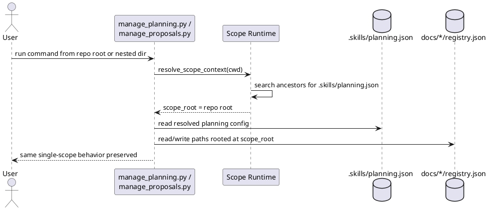

# Implementation Plan: Add scope runtime with root fallback

**Slice**: `hss-root-fallback-add-scope-runtime-with-root-fallback`  
**Date**: 2026-04-03  
**Status**: Reviewed for close-slice
**Spec**: `brief.md`

## 1. Summary

Introduce a shared scope-runtime helper that resolves the repository-root
planning scope for the current single-scope workflow, then move planning and
proposal config/registry path resolution onto that helper without changing the
current command surface.

The first implementation slice does not add nested-scope targeting yet. It
creates the reusable runtime contract and preserves existing repository-root
behavior from both the repo root and nested working directories.

## 2. Technical Context

- Current system context:
  - `skills/guide-planning/scripts/manage_planning.py` and
    `skills/propose/scripts/manage_proposals.py` read `.skills/planning.json`
    directly from the current working directory.
  - Registry helpers currently interpret configured `planning_dir` and
    `proposal_dir` relative to the current working directory rather than a
    resolved scope root.
- Target modules / files:
  - new shared helper module at `skills/guide-planning/scripts/scope_runtime.py`
    consumed by both planning and proposal helpers
  - `skills/guide-planning/scripts/manage_planning.py`
  - `skills/propose/scripts/manage_proposals.py`
  - `skills/guide-planning/tests/test_manage_planning.py`
  - `skills/propose/tests/test_manage_proposals.py`
- Constraints:
  - keep existing CLI usage unchanged
  - preserve current single-scope behavior
  - avoid implementing nested-scope selection, ambiguity handling, or scoped
    execution in this slice
- Assumptions:
  - repositories with a root `.skills/planning.json` should resolve that root
    even when commands run from nested directories
  - when no planning config exists, a repository root can be inferred from a
    `.git` marker for init/default-path behavior
- Out of scope:
  - nested local registries
  - `--scope` or `--target-scope` CLI flags
  - execution-layer scope behavior

## 3. Planning Gates

### Architecture / Constraints

- Decision: add one small shared runtime helper and keep planning/proposal
  helpers as consumers of resolved scope paths.
- Result: PASS
- Notes: this establishes the shared contract required by later hierarchical
  slices without spreading path-discovery logic across commands.

### Risk / Compliance

- Decision: keep the slice behavior backward compatible and confine writes to
  the resolved repository-root scope.
- Result: PASS
- Notes: no new security or retention risk is introduced; the main risk is
  accidental path drift, which is mitigated by regression tests.

### Testability

- Decision: prove the change with planning/proposal tests that run from nested
  directories and assert writes still land in the repository-root planning area.
- Result: PASS
- Notes: every requirement maps to concrete pytest coverage plus the full repo
  suite regression check.

## 4. Requirement Traceability

| Requirement | Implementation Steps | Validation |
| --- | --- | --- |
| FR-001 | S001, S002, S004 | V001, V003 |
| FR-002 | S002, S003, S004 | V001, V002, V003 |
| FR-003 | S001, S002, S003 | V001, V002 |
| FR-004 | S002, S003, S004 | V001, V003 |
| FR-005 | S001, S002 | V001, V003 |

## 5. Execution Plan

### Packet P01: Shared scope runtime

- Scope: add the reusable root-fallback scope resolver and integrate it into the
  planning helper.
- Target files:
  - `skills/guide-planning/scripts/scope_runtime.py`
  - `skills/guide-planning/scripts/manage_planning.py`
  - `skills/guide-planning/tests/test_manage_planning.py`
- Dependencies: none
- Steps:
  - [ ] S001 Add a small shared scope-runtime helper that resolves a repository
        root / scope root from the current working directory.
  - [ ] S002 Refactor planning config loading and registry path resolution to use
        the resolved scope root for config reads and relative planning paths.
  - [ ] S003 Update planning init/write flows so nested-directory execution still
        writes root config and registries for the single-scope case.
- Validation:
  - [ ] V001 `pytest -q skills/guide-planning/tests/test_manage_planning.py`
- Definition of Done: planning helpers no longer depend on current-working-dir
  `.skills/planning.json` lookups for the root single-scope workflow.
- Rollback / Mitigation: revert the planning helper to direct root-relative
  config access if the shared runtime introduces path regressions.

### Packet P02: Proposal integration and regression coverage

- Scope: consume the same scope runtime from proposal helpers and add parity
  tests for root fallback.
- Target files:
  - `skills/propose/scripts/manage_proposals.py`
  - `skills/propose/tests/test_manage_proposals.py`
- Dependencies: P01
- Steps:
  - [ ] S004 Refactor proposal config loading, registry paths, and proposal root
        creation to use the shared scope runtime.
  - [ ] S005 Add nested-working-directory tests for planning and proposal flows,
        including repo-root fallback when `.git` marks the repository root.
- Validation:
  - [ ] V002 `pytest -q skills/propose/tests/test_manage_proposals.py`
  - [ ] V003 `pytest -q`
- Definition of Done: proposal helpers match planning root-fallback behavior and
  the repo suite passes unchanged.
- Rollback / Mitigation: restrict the runtime use to planning only and land
  proposal integration in a follow-up slice if parity cannot be kept safely.

## 6. Supporting Notes

### Detailed Design Diagrams (PlantUML)

- Diagram purpose: show the root-fallback resolution flow for planning/proposal
  helpers in the single-scope case.
- Diagram type: sequence

### Research Decisions

- Decision: use a shared helper now instead of duplicating root-fallback logic
  in both planning and proposal scripts.
- Rationale: later hierarchical slices need one extension point for nested-scope
  behavior.
- Alternative considered: patch each script independently to walk upward for
  `.skills/planning.json`; rejected because it would duplicate the future scope
  contract immediately.

### Interface Notes

- Interface: scope runtime helper
- Inputs / outputs:
  - input: current working directory or explicit start path
  - output: resolved scope root and planning-config path
- Error states / compatibility notes:
  - if no config is found, default to repository root when a `.git` marker is
    present; otherwise keep current local fallback behavior

### Verification Scenarios

- Happy path:
  - run planning/proposal commands from a nested directory in a repo with root
    planning config and confirm writes land in root docs locations
- Edge case:
  - run init from a nested directory in a repo marked by `.git` but without
    existing planning config and confirm root `.skills/` is created
- Regression checks:
  - existing root-based planning and proposal tests continue to pass
  - full `pytest -q` remains green

## 7. Delivery Notes

- Sequencing rationale: land the shared runtime and planning integration first,
  then proposal parity, then full regression.
- Risks to monitor: accidentally resolving paths relative to the nested working
  directory, or changing init/write behavior for existing single-scope repos.
- Handoff notes for implementation: keep the runtime minimal and root-focused in
  this slice; do not add nested-scope selection or config inheritance behavior
  yet.

## 8. Execution Review Outcome

- Outcome: ready for `close-slice`
- Review classification:
  - brief-to-implementation gap: none
  - intent-to-brief gap: none
  - follow-up outside the active slice: none
- Durable artifact correction:
  - the implementation kept the shared scope runtime adjacent to
    `manage_planning.py` at
    `skills/guide-planning/scripts/scope_runtime.py` and reused it from
    `manage_proposals.py`; this blueprint now reflects the landed helper
    location instead of the earlier `skills/shared/` placeholder
- Validation evidence:
  - `pytest -q skills/guide-planning/tests/test_manage_planning.py skills/propose/tests/test_manage_proposals.py`
  - `pytest -q`
