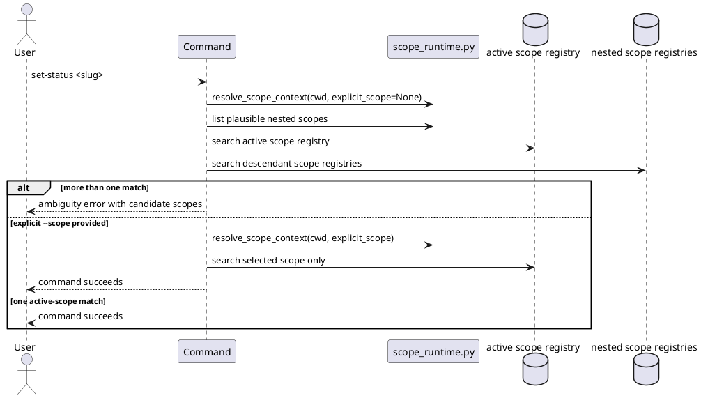

# Implementation Plan: Require explicit scope selection for ambiguous lookups

**Slice**: `hss-scope-selection-require-explicit-scope-selection-for-ambiguous-lookups`  
**Date**: 2026-04-03  
**Status**: Reviewed for close-slice
**Spec**: `brief.md`

## 1. Summary

HSS-04 adds safe ambiguity handling for multi-scope feature and proposal
lookups. Slug-only selectors that could match more than one plausible scope must
stop with candidate scope information, while an additive `--scope` flag lets the
user explicitly choose the intended scope.

The slice stays bounded to generic lookup safety. It does not add
`--target-scope` promotion targeting or config inheritance.

## 2. Technical Context

- Current system context:
  - `scope_runtime.py` resolves one active scope from the working directory but
    does not enumerate nested explicit scopes under that active scope.
  - `manage_planning.py` and `manage_proposals.py` only search the active scope's
    registry, so ambiguous descendant matches are currently invisible.
  - Existing CLI parsers do not expose `--scope` for lookup commands.
- Target modules / files:
  - `skills/guide-planning/scripts/scope_runtime.py`
  - `skills/guide-planning/scripts/manage_planning.py`
  - `skills/propose/scripts/manage_proposals.py`
  - `skills/guide-planning/tests/test_manage_planning.py`
  - `skills/propose/tests/test_manage_proposals.py`
- Constraints:
  - keep backward compatibility for single-scope and unambiguous lookups
  - keep the change additive through `--scope`
  - do not add `--target-scope`, config inheritance, or execution-scope behavior
- Assumptions:
  - explicit scopes are still represented by local `.skills/planning.json`
  - plausible scopes for ambiguity detection are the active scope plus nested
    explicit scopes beneath it
- Out of scope:
  - cross-scope promotion target selection
  - scope-local execution
  - inherited config resolution across a scope chain

## 3. Planning Gates

### Architecture / Constraints

- Decision: extend the scope runtime with explicit-scope resolution and nested
  scope enumeration, then reuse that in both planning and proposal helpers.
- Result: PASS
- Notes: this keeps the ambiguity contract shared instead of duplicating repo
  scans in two command stacks.

### Risk / Compliance

- Decision: fail ambiguous slug-only lookups instead of auto-selecting a scope,
  and require `--scope` for explicit override.
- Result: PASS
- Notes: safe failure is the core compatibility guard for multi-scope repos.

### Testability

- Decision: add paired planning/proposal tests for ambiguous lookups, explicit
  `--scope` success, and single-scope backward compatibility.
- Result: PASS
- Notes: the slice is only complete when both helpers enforce the same contract.

## 4. Requirement Traceability

| Requirement | Implementation Steps | Validation |
| --- | --- | --- |
| FR-001 | S001, S002, S004 | V001, V002 |
| FR-002 | S002, S004 | V001, V002 |
| FR-003 | S001, S003, S004 | V001, V002 |
| FR-004 | S002, S003, S004 | V001, V002, V003 |
| FR-005 | S001, S004 | V001, V002, V003 |

## 5. Execution Plan

### Packet P01: Shared scope-selection runtime

- Scope: add the shared runtime support needed to resolve explicit scope paths
  and enumerate nested explicit scopes under the active scope.
- Target files:
  - `skills/guide-planning/scripts/scope_runtime.py`
- Dependencies: hss-nearest-scope
- Steps:
  - [ ] S001 Extend `resolve_scope_context()` to accept an optional explicit
        scope path and validate it against the repository root.
  - [ ] S002 Add a helper that enumerates explicit nested planning scopes beneath
        the active scope so lookup commands can detect descendant matches.
- Validation:
  - [ ] V001 `pytest -q skills/guide-planning/tests/test_manage_planning.py`
- Definition of Done: the shared runtime can resolve either the default active
  scope or an explicit `--scope`, and can list plausible nested scopes.
- Rollback / Mitigation: keep the runtime helpers additive and revert to the
  previous single-scope resolution if ambiguity detection proves unstable.

### Packet P02: Planning and proposal ambiguity handling

- Scope: use the runtime helpers to detect ambiguous slug-only lookups, expose
  `--scope`, and fail safely when the selector could match multiple scopes.
- Target files:
  - `skills/guide-planning/scripts/manage_planning.py`
  - `skills/propose/scripts/manage_proposals.py`
  - `skills/guide-planning/tests/test_manage_planning.py`
  - `skills/propose/tests/test_manage_proposals.py`
- Dependencies: P01
- Steps:
  - [ ] S003 Add `--scope` to planning/proposal commands that look up existing
        features or proposals.
  - [ ] S004 Implement ambiguity-aware selector resolution for planning/proposal
        lookups, including candidate-scope error messages.
  - [ ] S005 Add tests covering ambiguous slug-only lookups, explicit `--scope`
        success, and unchanged single-scope behavior.
- Validation:
  - [ ] V002 `pytest -q skills/guide-planning/tests/test_manage_planning.py skills/propose/tests/test_manage_proposals.py`
  - [ ] V003 `pytest -q`
- Definition of Done: ambiguous planning/proposal lookups fail safely unless the
  user explicitly selects a scope, and existing single-scope flows still pass.
- Rollback / Mitigation: if proposal and planning behavior diverge, keep the
  runtime helpers and land ambiguity enforcement first in the helper that can be
  stabilized safely without widening the slice.

## 6. Supporting Notes

### Detailed Design Diagrams (PlantUML)

- Diagram purpose: show how lookup resolution checks the active scope subtree and
  stops on ambiguity.
- Diagram type: sequence

### Research Decisions

- Decision: treat descendant scopes under the active scope as the plausible
  ambiguity set.
- Rationale: this preserves nearest-scope semantics while still catching the
  unsafe repo-root case where nested scopes exist below the current scope.
- Alternative considered: search the whole repository and auto-select a unique
  off-scope match; rejected because it would silently widen the command's scope.

### Interface Notes

- Interface: `--scope`
- Inputs / outputs:
  - input: optional scope path for planning/proposal lookup commands
  - output: one explicitly selected scope context when provided
- Error states / compatibility notes:
  - invalid `--scope` paths must fail clearly
  - ambiguous slug-only lookups must list candidate scopes
  - single-scope repositories continue to work unchanged

### Verification Scenarios

- Happy path:
  - ambiguous slug lookup fails, then succeeds when rerun with `--scope`
- Edge case:
  - a slug exists only in a nested descendant scope and does not silently become
    the active-scope result
- Regression checks:
  - root fallback and nearest-enclosing child-scope tests stay green
  - full `pytest -q` remains green

## 7. Delivery Notes

- Sequencing rationale: add the shared scope-selection mechanics first, then wire
  both helpers onto the same ambiguity contract.
- Risks to monitor: inconsistent candidate-scope formatting between planning and
  proposal helpers, or an overly broad repo scan that changes default behavior in
  unambiguous cases.
- Handoff notes for implementation: keep the explicit-scope contract narrow and
  additive so hss-promotion-targeting can layer on `--target-scope` next.

## 8. Execution Review Outcome

- Outcome: ready for `close-slice`
- Review classification:
  - brief-to-implementation gap: none
  - intent-to-brief gap: none
  - follow-up outside the active slice: none
- Durable artifact note:
  - HSS-04 added explicit `--scope` handling plus ambiguity detection across the
    active scope subtree in the shared scope runtime, planning helper, and
    proposal helper
- Validation evidence:
  - `pytest -q skills/guide-planning/tests/test_manage_planning.py skills/propose/tests/test_manage_proposals.py`
  - `pytest -q`
