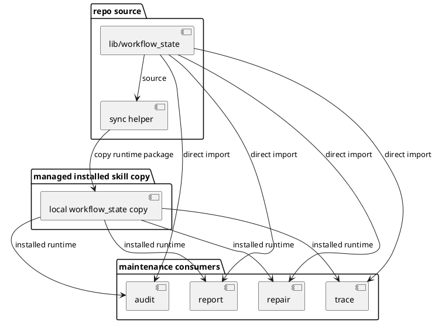

# Implementation Plan: Adopt shared reconciliation across maintenance skills

**Slice**: `wsc-maintenance-adoption`  
**Date**: 2026-04-19  
**Status**: Reviewed for close-slice  
**Spec**: `brief.md`

## 1. Summary

This slice moves the audit, trace, repair, and report maintenance flows onto the
canonical `workflow_state` library introduced in `wsc-shared-library`, then
adds deterministic runtime syncing so the managed installed skill copies remain
self-contained and preserve the same shared interpretation outside the repo
working tree. The implementation should tighten maintenance-consumer ownership
around the shared library, keep the compatibility shim available for unchanged
callers, and add regression coverage for the packaged runtime path.

## 2. Technical Context

- Current system context:
  - `lib/workflow_state/` is now the canonical shared library, while
    `skills/audit-artifacts/scripts/artifact_inventory.py` is a compatibility
    shim that re-exports that surface for legacy callers.
  - `audit_artifacts.py` still imports through the compatibility shim, and
    `trace_data.py`, `repair_data.py`, and `report_data.py` still depend on the
    audit skill's script directory to reach that shim.
  - Managed skill installation (`make install`) currently syncs shared
    documentation references only; it does not copy shared Python runtime files
    into self-contained skill folders.
  - The installed `ship` copy already exposed the risk: when a
    self-contained skill cannot reach repo-root `lib/workflow_state`, imports
    fail even though repo-local execution still works.
- Target modules / files:
  - `skills/audit-artifacts/scripts/audit_artifacts.py`
  - `skills/audit-artifacts/scripts/artifact_inventory.py`
  - `skills/trace-artifacts/scripts/trace_data.py`
  - `skills/repair-artifacts/scripts/repair_data.py`
  - `skills/report-artifacts/scripts/report_data.py`
  - `Makefile`
  - `scripts/` helper for syncing shared runtime dependencies into managed skill
    folders before install
  - targeted regression tests under `skills/audit-artifacts/tests/`,
    `skills/trace-artifacts/tests/`, `skills/repair-artifacts/tests/`, and
    `skills/report-artifacts/tests/`
- Constraints:
  - preserve the shared-library slice boundary by reusing `lib/workflow_state`
    instead of re-implementing workflow-state logic in each skill
  - keep maintenance workflows read-only with respect to planning and execution
    ownership boundaries
  - keep skill installation generic and deterministic rather than introducing
    manual packaging steps
  - avoid widening this slice into semantic-preview, transition-guardrail,
    parity, or CI-hook behavior from later planned slices
- Assumptions:
  - maintenance consumers can import the shared library directly once they know
    how to find either the repo-root `lib/` path or a synced local copy
  - the compatibility shim remains useful for non-maintenance callers that are
    not in this slice
  - a sync helper can materialize the shared runtime package into managed skill
    folders without changing the public install command
- Out of scope:
  - semantic drift preview output changes
  - transition-owner enforcement
  - installed-vs-repo parity reporting
  - CI validation entrypoints beyond the slice's package/install regression

## 3. Planning Gates

### Architecture / Constraints

- Decision: Move the four maintenance consumers to direct `workflow_state`
  imports, while keeping `artifact_inventory.py` as a compatibility bridge for
  unchanged callers and syncing a local `workflow_state` package into managed
  skill folders for self-contained installs.
- Result: PASS
- Notes: This keeps one canonical runtime library while removing the audit-skill
  wrapper as the maintenance-layer import hub.

### Risk / Compliance

- Decision: Limit the change to read-only maintenance consumers and deterministic
  packaging helpers; do not broaden write ownership or introduce networked
  install behavior.
- Result: PASS
- Notes: The main risk is packaging drift between repo-local and installed
  copies, so the sync helper and isolated regression checks are required.

### Testability

- Decision: Reuse the existing targeted maintenance suites and add isolated
  packaged-runtime checks that exercise the self-contained import path after the
  sync step.
- Result: PASS
- Notes: The validation path stays concrete: repo-local maintenance tests plus a
  managed install/package regression for the shared runtime copy.

## 4. Requirement Traceability

| Requirement | Implementation Steps | Validation |
| --- | --- | --- |
| FR-001 | S001, S002 | V001, V002 |
| FR-002 | S001, S005 | V001 |
| FR-003 | S001, S003 | V001, V002 |
| FR-004 | S003, S004 | V002 |
| FR-005 | S001, S002 | V001 |

## 5. Execution Plan

### Packet P01: Route maintenance consumers to the shared library

- Scope: Make audit, trace, repair, and report consume `workflow_state`
  directly instead of reaching shared semantics through the audit skill's
  wrapper.
- Target files:
  - `skills/audit-artifacts/scripts/audit_artifacts.py`
  - `skills/trace-artifacts/scripts/trace_data.py`
  - `skills/repair-artifacts/scripts/repair_data.py`
  - `skills/report-artifacts/scripts/report_data.py`
  - `skills/audit-artifacts/scripts/artifact_inventory.py`
- Dependencies: `wsc-shared-library`
- Steps:
  - [x] S001 Add a consistent runtime-path bootstrap pattern that can load
        `workflow_state` from either repo-root `lib/` or a synced skill-local
        copy.
  - [x] S002 Update the maintenance consumers to import the shared inventory
        helpers from `workflow_state` directly, leaving `artifact_inventory.py`
        as a compatibility shim for unchanged callers.
  - [x] S003 Keep user-facing maintenance behavior stable by preserving the same
        normalized inventory and traceability interpretation across audit, trace,
        repair, and report flows.
- Validation:
  - [x] V001 Run `pytest -q skills/audit-artifacts/tests/test_audit_artifacts.py skills/trace-artifacts/tests/test_trace_artifacts.py skills/repair-artifacts/tests/test_repair_artifacts.py skills/report-artifacts/tests/test_report_artifacts.py`
- Definition of Done: The targeted maintenance consumers depend directly on the
  canonical shared library and still pass their repo-local regression coverage.
- Rollback / Mitigation: If a direct import change proves too brittle, centralize
  the path bootstrap and keep the compatibility shim in place for any consumer
  that cannot move cleanly within this slice.

### Packet P02: Sync shared runtime files into managed skill folders

- Scope: Make managed installed maintenance skills self-contained by copying the
  shared runtime package into the relevant skill folders before install.
- Target files:
  - `Makefile`
  - new sync helper under `scripts/`
  - skill-local synced runtime folders under the affected maintenance skills
- Dependencies: P01
- Steps:
  - [x] S004 Add a sync helper that copies `lib/workflow_state/` into the
        managed maintenance skill folders in a deterministic, repeatable way.
  - [x] S005 Wire that helper into the existing install flow so `make install`
        refreshes shared runtime dependencies before `npx skills add` packages
        the managed skills.
- Validation:
  - [x] V002 Run the targeted maintenance suite and an isolated package/runtime
        regression that verifies a self-contained synced skill copy can import
        `workflow_state` without access to repo-root `lib/`.
- Definition of Done: A refreshed managed install path produces maintenance
  skill folders that contain the shared runtime package they need at execution
  time.
- Rollback / Mitigation: If syncing every maintenance skill proves noisy, limit
  the synced targets to the skills touched by this slice and keep the helper
  idempotent so later slices can extend it safely.

### Packet P03: Lock the packaged runtime path with regression coverage

- Scope: Add tests that fail when repo-local and self-contained installed
  maintenance runtimes drift apart.
- Target files:
  - `skills/audit-artifacts/tests/test_audit_artifacts.py`
  - `skills/trace-artifacts/tests/test_trace_artifacts.py`
  - `skills/repair-artifacts/tests/test_repair_artifacts.py`
  - `skills/report-artifacts/tests/test_report_artifacts.py`
  - optional focused tests for the new sync helper
- Dependencies: P01, P02
- Steps:
  - [x] S006 Add isolated runtime tests or helper tests that stage synced skill
        files in a temporary directory and exercise the packaged import path.
  - [x] S007 Ensure the new coverage proves both behavioral consistency and the
        presence of the shared runtime package in managed skill folders.
- Validation:
  - [x] V003 Run `pytest -q skills/audit-artifacts/tests/test_audit_artifacts.py skills/trace-artifacts/tests/test_trace_artifacts.py skills/repair-artifacts/tests/test_repair_artifacts.py skills/report-artifacts/tests/test_report_artifacts.py`
- Definition of Done: Regression coverage fails if maintenance skills stop using
  the shared library consistently or if the managed install flow stops bundling
  the required runtime package.
- Rollback / Mitigation: If isolated runtime tests become too brittle, narrow
  them to focused sync-helper and import-smoke checks while keeping the
  behavioral suites as the primary safety net.

## 6. Supporting Notes

### Detailed Design Diagrams (PlantUML)

- Diagram purpose: show how repo-local execution and self-contained installed
  maintenance skills should converge on the same shared runtime package.
- Diagram type: component

### Research Decisions

- Decision: keep `artifact_inventory.py` as a compatibility shim, but stop
  using it as the primary import surface for the four maintenance consumers
- Rationale: this narrows the maintenance-layer dependency graph while preserving
  a stable bridge for unchanged callers outside the slice
- Alternative considered: continue routing all consumers through the audit
  wrapper and sync that wrapper into every other installed skill

### Interface Notes

- Interface: `workflow_state.inventory`
- Inputs / outputs:
  - inputs: planning/proposal/execution registries, traceability markdown files,
    artifact directories
  - outputs: normalized inventory rows, traceability records, and path helpers
- Error states / compatibility notes:
  - malformed metadata should continue surfacing explicit errors
  - missing traceability files should continue returning empty record sets
  - maintenance consumers should be able to load `workflow_state` from either
    repo-root `lib/` or a synced skill-local copy

### Verification Scenarios

- Happy path: audit, trace, repair, and report all continue returning the same
  findings with direct shared-library imports
- Edge case: a synced self-contained skill copy runs without access to
  repository-root `lib/` and still imports `workflow_state`
- Regression checks: the targeted maintenance suites stay green and the sync
  helper remains idempotent across repeated runs

## 7. Delivery Notes

- Sequencing rationale: move consumers first so the runtime dependency surface
  is explicit, then sync the shared package into skill folders, then lock the
  install path with regression coverage.
- Risks to monitor:
  - import-path breakage between repo-local and synced skill-local runtimes
  - accidental packaging drift if the sync helper misses one affected skill
  - widening this slice into non-maintenance consumers before the current packet
    is stable
- Handoff notes for implementation:
  - prefer a single small path-bootstrap pattern over many ad hoc import hacks
  - keep `artifact_inventory.py` available for compatibility but not as the main
    maintenance-consumer dependency
  - stop once maintenance consumers, synced installs, and targeted tests all
    agree on the same shared-library behavior

## 8. Execution Review Outcome

- Outcome: ready for `close-slice`
- Review classification:
  - brief-to-implementation gap: none
  - intent-to-brief gap: none
  - follow-up improvement outside the active slice:
    - `archive-artifacts`, `measure-artifacts`, and `ship` still
      rely on compatibility-path imports or separate packaging assumptions that
      remain outside this maintenance-consumer adoption slice
