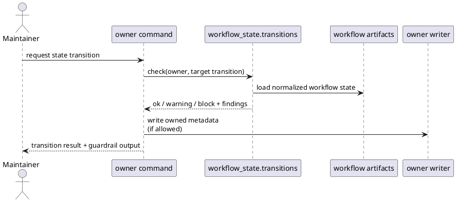

# Implementation Plan: Add high-confidence transition consistency checks

**Slice**: `wsc-transition-guardrails`  
**Date**: 2026-04-19  
**Status**: Reviewed for close-slice  
**Spec**: `brief.md`

## 1. Summary

This slice adds a shared transition-check runtime to `workflow_state` and wires
it into the owner scripts that perform important planning, subfeature,
execution, and close/finalize state changes. The goal is to surface the same
high-confidence semantic findings that WSC-03 made previewable, while preserving
writer ownership and keeping clean transitions low-friction.

## 2. Technical Context

- Current system context:
  - `lib/workflow_state/semantic_preview.py` now provides a stable shared
    semantic finding shape, but no owner script calls shared transition checks
    before or after state mutations.
  - `guide-planning`, `add-subfeature`, `guide-execution`, and `close-slice`
    still manage transitions locally and do not currently vendor the shared
    `workflow_state` runtime for installed copies.
  - The system design already expects `workflow_state.transitions` to support
    `ok / warning / block` outcomes around important owner transitions.
- Target modules / files:
  - new shared transition helper under `lib/workflow_state/`
  - `lib/workflow_state/__init__.py` and any shared models needed for transition
    results
  - `scripts/sync_shared_skill_runtime.py`
  - vendored runtime copies under:
    - `skills/guide-planning/lib/workflow_state/`
    - `skills/add-subfeature/lib/workflow_state/`
    - `skills/guide-execution/lib/workflow_state/`
    - `skills/close-slice/lib/workflow_state/`
  - owner scripts:
    - `skills/guide-planning/scripts/manage_planning.py`
    - `skills/add-subfeature/scripts/manage_subfeatures.py`
    - `skills/guide-execution/scripts/manage_execution.py`
    - `skills/close-slice/scripts/close_slice.py`
  - targeted tests under the corresponding skill test directories
- Constraints:
  - preserve current write ownership; the shared runtime may inspect and
    classify, but it must not write planning, subfeature, or execution metadata
    directly
  - keep guardrails limited to the reviewed high-confidence invariants and avoid
    new repository configuration for the first rollout
  - preserve existing CLI behavior for clean transitions
  - reuse existing explicit operator-choice surfaces such as `--force` and
    `--confirm-impact` instead of inventing a second override mechanism
  - keep installed skill copies self-contained by syncing the shared runtime
- Assumptions:
  - the `SemanticPreviewRecord` shape from WSC-03 is the right base contract for
    owner-visible workflow-state findings
  - a small shared transition result wrapper can express warning vs block
    severity without forcing each owner to reinterpret the same finding codes
  - close/finalize flows are the highest-value places to enforce blocking
    behavior, while other owner transitions can start with warnings when they
    surface the same drift class
- Out of scope:
  - expanding semantic checks beyond the reviewed high-confidence invariants
  - adding new config flags for warning/block policy tuning
  - parity inspection and CI validation hooks
  - any owner-mediated metadata repair path beyond the current deterministic
    owner writes

## 3. Planning Gates

### Architecture / Constraints

- Decision: Add a shared `workflow_state.transitions` helper that returns
  structured findings plus `ok / warning / block` outcomes, then have the owner
  scripts call it around their existing transition paths.
- Result: PASS
- Notes: This keeps semantics centralized, avoids four separate policy forks,
  and matches the system-design sequence already approved for the feature.

### Risk / Compliance

- Decision: Keep guardrails narrow and deterministic, use warning mode for
  non-blocking owner flows, and require explicit operator choice through the
  existing `--force` or `--confirm-impact` surfaces when blocking findings are
  encountered.
- Result: PASS
- Notes: The main risk is noisy or surprising transitions, so the initial policy
  should focus on the reviewed stale-state cases and preserve clean-command
  behavior.

### Testability

- Decision: Extend the four targeted owner suites with stale-state and clean-path
  fixtures that exercise both warning and blocking outcomes through the existing
  CLIs.
- Result: PASS
- Notes: The tests already cover the relevant transition entry points, so the
  slice can stay narrow and still verify every owner touched by the plan.

## 4. Requirement Traceability

| Requirement | Implementation Steps | Validation |
| --- | --- | --- |
| FR-001 | S001, S003, S005 | V001, V002, V003 |
| FR-002 | S001, S002, S003, S005 | V001, V002, V003 |
| FR-003 | S001, S004, S006 | V001, V002, V003 |
| FR-004 | S001, S003, S005 | V001, V002, V003 |
| FR-005 | S007, S008 | V001, V002, V003 |

## 5. Execution Plan

### Packet P01: Create the shared transition-check runtime

- Scope: Add the reusable transition-check surface and make it available to both
  repo-local and installed owner scripts.
- Target files:
  - new `lib/workflow_state/transitions.py`
  - `lib/workflow_state/models.py` if a shared transition result model is needed
  - `lib/workflow_state/__init__.py`
  - `scripts/sync_shared_skill_runtime.py`
  - vendored runtime copies under `skills/guide-planning/lib/`,
    `skills/add-subfeature/lib/`, `skills/guide-execution/lib/`, and
    `skills/close-slice/lib/`
- Dependencies: `wsc-semantic-preview`
- Steps:
  - [x] S001 Define the shared transition-check contract, including warning vs
        block outcomes and the normalized finding payload owners will surface.
  - [x] S002 Implement the first reviewed high-confidence transition checks by
        reusing the shared semantic finding contract instead of hardcoding
        owner-local message logic.
- Validation:
  - [x] V001 Run `pytest -q skills/guide-planning/tests/test_manage_planning.py skills/add-subfeature/tests/test_manage_subfeatures.py`
- Definition of Done: Owner scripts can import one shared transition-check
  helper from both the repo and synced installed copies.
- Rollback / Mitigation: If the shared result contract feels too broad, keep the
  wrapper minimal and let owner-specific rendering stay thin while the finding
  shape remains shared.

### Packet P02: Wire planning and subfeature owners onto the shared guardrails

- Scope: Surface shared transition findings during planning and durable
  subfeature transitions without changing metadata ownership.
- Target files:
  - `skills/guide-planning/scripts/manage_planning.py`
  - `skills/add-subfeature/scripts/manage_subfeatures.py`
  - `skills/guide-planning/tests/test_manage_planning.py`
  - `skills/add-subfeature/tests/test_manage_subfeatures.py`
- Dependencies: P01
- Steps:
  - [x] S003 Call the shared transition helper from `guide-planning` around the
        important feature transitions in scope for this slice and surface warning
        or blocking findings through the existing CLI result path.
  - [x] S004 Call the shared transition helper from `add-subfeature` around the
        in-scope subfeature transitions, using explicit operator choice when a
        finalized/closed linkage would otherwise leave stale state behind.
- Validation:
  - [x] V002 Run `pytest -q skills/guide-planning/tests/test_manage_planning.py skills/add-subfeature/tests/test_manage_subfeatures.py`
- Definition of Done: Planning and subfeature owner commands surface the shared
  transition findings for the reviewed stale-state cases while clean transitions
  still succeed.
- Rollback / Mitigation: If a blocking policy proves too aggressive in one owner
  flow, degrade that case to warning mode for this slice and capture stricter
  enforcement as a follow-up planning item.

### Packet P03: Wire execution and close/finalize owners onto the same guardrails

- Scope: Reuse the same transition-check contract during execution status changes
  and explicit slice closure.
- Target files:
  - `skills/guide-execution/scripts/manage_execution.py`
  - `skills/close-slice/scripts/close_slice.py`
  - `skills/guide-execution/tests/test_manage_execution.py`
  - `skills/close-slice/tests/test_close_slice.py`
- Dependencies: P01
- Steps:
  - [x] S005 Call the shared transition helper from `guide-execution` around the
        in-scope status transitions so execution owners surface the same
        high-confidence findings as other lifecycle owners.
  - [x] S006 Make `close-slice` reuse the shared transition findings and map any
        blocking cases to the existing explicit operator-choice surfaces instead
        of duplicating closure-only guardrail logic.
- Validation:
  - [x] V003 Run `pytest -q skills/guide-execution/tests/test_manage_execution.py skills/close-slice/tests/test_close_slice.py`
- Definition of Done: Execution and close/finalize owners surface the same
  shared transition findings and keep clean closure paths intact.
- Rollback / Mitigation: If closure-specific enforcement becomes tangled with
  relation handling, keep the relation path separate and scope the transition
  helper to semantic state checks only.

### Packet P04: Lock the owner behavior with regression coverage

- Scope: Add focused tests that prove shared transition findings are reused
  consistently across all four owner flows.
- Target files:
  - `skills/guide-planning/tests/test_manage_planning.py`
  - `skills/add-subfeature/tests/test_manage_subfeatures.py`
  - `skills/guide-execution/tests/test_manage_execution.py`
  - `skills/close-slice/tests/test_close_slice.py`
- Dependencies: P02, P03
- Steps:
  - [x] S007 Add stale-state fixtures and assertions for warning/block outcomes
        in the touched owner suites.
  - [x] S008 Add clean-transition assertions so the new guardrails do not create
        unrelated friction in existing owner flows.
- Validation:
  - [x] V004 Run `pytest -q skills/guide-planning/tests/test_manage_planning.py skills/add-subfeature/tests/test_manage_subfeatures.py skills/guide-execution/tests/test_manage_execution.py skills/close-slice/tests/test_close_slice.py`
- Definition of Done: The four owner suites fail if the shared transition
  contract drifts or if clean transitions regress.
- Rollback / Mitigation: If one stale-state fixture is too brittle, narrow it to
  the highest-confidence invariant already called out in the system design and
  defer broader cases.

## 6. Supporting Notes

### Detailed Design Diagrams (PlantUML)

- Diagram purpose: show owners calling one shared transition helper around their
  existing mutation paths while preserving writer ownership.
- Diagram type: sequence

### Research Decisions

- Decision: extend the shared runtime with a dedicated transition helper instead
  of letting each owner call `build_semantic_preview` directly
- Rationale: owner flows need severity, policy, and transition context in
  addition to the shared finding payload, and that logic still belongs in one
  reusable place
- Alternative considered: render preview records directly inside each owner
  script

### Data Model Notes

- Entity: transition check result
- Fields / relationships:
  - owner / transition context
  - outcome (`ok`, `warning`, `block`)
  - normalized workflow-state findings
  - optional operator-choice hint (`--force` / `--confirm-impact`)
- Validation rules:
  - finding payloads should stay serializable and compatible with the shared
    semantic finding contract
  - blocking findings must remain limited to reviewed high-confidence cases

### Interface Notes

- Interface: `workflow_state.transitions`
- Inputs / outputs:
  - inputs: normalized inventory, owner kind, target transition, and current
    operator-choice mode
  - outputs: shared findings plus an owner-facing outcome classification
- Error states / compatibility notes:
  - malformed metadata should still fail clearly through the owner command, not
    be downgraded into a transition finding
  - owners should reuse their existing stdout/stderr and exit-code patterns when
    surfacing warnings or blocking conditions

### Verification Scenarios

- Happy path: a clean planning, subfeature, execution, or closure transition
  completes normally without extra friction
- Edge case: a close/finalize transition hits a reviewed stale-state invariant
  and requires explicit operator choice before continuing
- Regression checks: the same semantic drift class surfaces consistently across
  preview/report output and the affected owner commands

## 7. Delivery Notes

- Sequencing rationale: establish the shared transition runtime and install-time
  sync first, then wire the two planning-layer owners, then the two
  execution-layer owners, then lock the behavior with focused tests.
- Risks to monitor:
  - noisy warnings if the initial invariant set grows beyond the reviewed cases
  - reintroducing repo-vs-installed runtime drift if the owner skill sync list
    is incomplete
  - diverging owner CLI messages if each script reformats shared findings too
    aggressively
- Handoff notes for implementation:
  - reuse the `SemanticPreviewRecord` shape where practical instead of inventing
    a second semantic finding format
  - prefer existing override surfaces (`--force`, `--confirm-impact`) over new
    flags
  - keep the first rollout narrow, with the close/finalize stale-state case as
    the clearest blocking invariant

## 8. Execution Review Outcome

- Outcome: ready for `close-slice`
- Review classification:
  - brief-to-implementation gap: none
  - intent-to-brief gap: none
  - follow-up improvement outside the active slice:
    - `wsc-validation-hooks` should reuse the shared
      `workflow_state.transitions` helper rather than re-deriving guardrail
      policy inside CI-only validation paths
