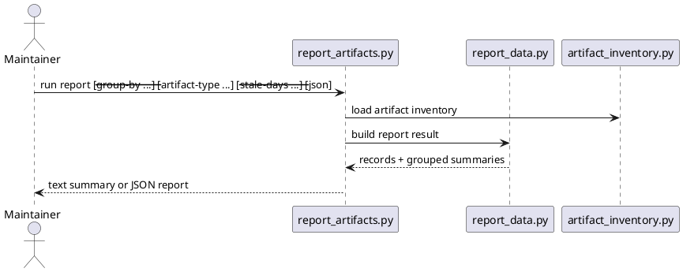

# Implementation Plan: Build the cross-artifact report command

**Slice**: `CAM-03-artifact-state-report`  
**Date**: 2026-04-11  
**Status**: Reviewed for close-slice  
**Spec**: `brief.md`

## 1. Summary

CAM-03 adds a read-only reporting layer for the repo's durable workflow
artifacts. The slice should reuse the shared inventory, normalize one reporting
record shape across proposals, features, subfeatures, and slices, support
grouped summaries plus stale classification, and ship a `report-artifacts`
skill and CLI with text and JSON output.

## 2. Technical Context

- Current system context:
  - `skills/audit-artifacts/scripts/artifact_inventory.py` already inventories
    proposals, features, subfeatures, and slices
  - proposal, planning, subfeature, and slice owner scripts already expose
    lifecycle metadata with status and update timestamps
  - no repo-wide reporting command currently summarizes that operational state
- Target modules / files:
  - `skills/report-artifacts/SKILL.md`
  - `skills/report-artifacts/scripts/report_data.py`
  - `skills/report-artifacts/scripts/report_artifacts.py`
  - `skills/report-artifacts/tests/test_report_artifacts.py`
  - `Makefile`
  - `README.md`
- Constraints:
  - keep the report read-only
  - avoid inventing a new universal lifecycle state model
  - keep stale detection explicit through a threshold parameter
- Assumptions:
  - report grouping can be built from one normalized record set
  - future automation can reuse the JSON output instead of parsing text
- Out of scope:
  - repair flows
  - archive flows
  - persistent dashboard files

## 3. Planning Gates

### Architecture / Constraints

- Decision: normalize one reporting-record layer from shared inventory plus
  owner metadata, then build overview and grouped output from that same layer.
- Result: PASS
- Notes: this keeps reporting read-only and reusable while avoiding a second
  state model.

### Risk / Compliance

- Decision: preserve raw owner statuses and compute staleness as a separate
  derived flag.
- Result: PASS
- Notes: status grouping should summarize existing lifecycle states rather than
  reclassifying them.

### Testability

- Decision: cover overview reporting, status grouping, parent grouping, and
  stale classification in a targeted test module, then run `pytest -q`.
- Result: PASS
- Notes: fixture-driven tests can generate the needed states without depending on
  real repo timestamps.

## 4. Requirement Traceability

| Requirement | Implementation Steps | Validation |
| --- | --- | --- |
| FR-001 | S001, S004, S007 | V001, V004 |
| FR-002 | S001, S002 | V001 |
| FR-003 | S003, S004 | V002, V003 |
| FR-004 | S002, S004 | V001, V003 |
| FR-005 | S004, S005 | V002, V004 |
| FR-006 | S004, S007 | V004 |

## 5. Execution Plan

### Packet P01: Normalize reporting records

- Scope: reuse shared inventory and normalize one read-only report record for
  each supported artifact.
- Target files:
  - `skills/report-artifacts/scripts/report_data.py`
  - `skills/report-artifacts/tests/test_report_artifacts.py`
- Dependencies: `skills/audit-artifacts/scripts/artifact_inventory.py`
- Steps:
  - [x] S001 Load the shared inventory and metadata-backed status/timestamp
        fields for proposals, features, subfeatures, and slices.
  - [x] S002 Compute parent feature context and explicit stale classification for
        each report record.
  - [x] S003 Build grouped report aggregates for overview, status, and parent
        views.
- Validation:
  - [x] V001 `pytest -q skills/report-artifacts/tests/test_report_artifacts.py -k overview`
- Definition of Done: one normalized report-record layer powers all grouped
- report views.
- Rollback / Mitigation: keep record normalization local to the new skill so the
  broader repo state model remains unchanged.

### Packet P02: Add the reporting CLI

- Scope: expose grouped summaries, artifact-type filtering, and shared text/JSON
  output from one result structure.
- Target files:
  - `skills/report-artifacts/scripts/report_artifacts.py`
  - `skills/report-artifacts/tests/test_report_artifacts.py`
- Dependencies: P01
- Steps:
  - [x] S004 Add CLI options for grouping, artifact-type filtering, stale-days,
        and JSON output.
  - [x] S005 Render text and JSON output from the same report result.
  - [x] S006 Keep the command read-only and fail clearly on invalid arguments.
- Validation:
  - [x] V002 `pytest -q skills/report-artifacts/tests/test_report_artifacts.py -k status`
  - [x] V003 `pytest -q skills/report-artifacts/tests/test_report_artifacts.py -k parent`
- Definition of Done: maintainers can generate operational workflow summaries
  from one read-only command.
- Rollback / Mitigation: keep grouping logic and rendering derived from the same
  in-memory result to avoid output drift.

### Packet P03: Ship the skill and repo wiring

- Scope: add the user-facing skill definition and managed install/docs wiring.
- Target files:
  - `skills/report-artifacts/SKILL.md`
  - `Makefile`
  - `README.md`
- Dependencies: P02
- Steps:
  - [x] S007 Author `skills/report-artifacts/SKILL.md` with overview and grouped
        reporting usage plus read-only guardrails.
  - [x] S008 Add `report-artifacts` to the managed skill set and top-level repo
        guidance.
- Validation:
  - [x] V004 `pytest -q`
- Definition of Done: the report capability is installed, documented, and
  validated in the managed skill set.
- Rollback / Mitigation: keep install/docs changes localized to the new skill.

## 6. Supporting Notes

### Detailed Design Diagrams (PlantUML)

- Diagram purpose: show how report normalizes durable metadata into grouped
  summaries without mutating repo artifacts.
- Diagram type: sequence

### Research Decisions

- Decision: keep stale classification separate from the raw owner status.
- Rationale: status summaries must reflect the existing workflow states, while
  staleness is an operator-focused signal layered on top.
- Alternative considered: collapsing statuses into a custom summary taxonomy;
  rejected because it would blur owner-script semantics.

### Interface Notes

- Interface: `python3 skills/report-artifacts/scripts/report_artifacts.py`
- Inputs / outputs:
  - input: optional repeated `--artifact-type`, optional `--group-by`, optional
    `--stale-days`, optional `--json`
  - output: human-readable summary by default, structured JSON when requested
- Error states / compatibility notes:
  - invalid CLI options should fail clearly
  - reporting stays read-only and must not rewrite any artifact

### Verification Scenarios

- Happy path:
  - summarize the repo and confirm overview counts by artifact type
- Edge cases:
  - group by status and confirm closed and reviewed artifacts remain distinct
  - group by parent and confirm subfeatures and slices roll up by feature
  - use a stale threshold that marks older artifacts as stale
- Regression checks:
  - text and JSON output are derived from the same report result
  - `pytest -q` remains green

## 7. Delivery Notes

- Sequencing rationale: normalize reporting records first, then add grouped CLI
  rendering, then expose the user-facing skill and install/docs wiring.
- Risks to monitor: stale classification being misread as a lifecycle state, or
  parent grouping losing ownership context for proposals and slices.
- Handoff notes for implementation: keep the record model simple, keep stale
  classification explicit, and keep the command read-only.

## 8. Execution Review Outcome

- Outcome: ready for `close-slice`
- Review classification:
  - brief-to-implementation gap: none
  - intent-to-brief gap: none
  - follow-up outside the active slice: none
- Durable artifact note:
  - CAM-03 adds `skills/report-artifacts/` as a read-only operational reporting
    capability with shared record normalization, grouped summaries, configurable
    stale classification, and human/JSON output.
- Validation evidence:
  - `pytest -q skills/report-artifacts/tests/test_report_artifacts.py`
  - `pytest -q`
