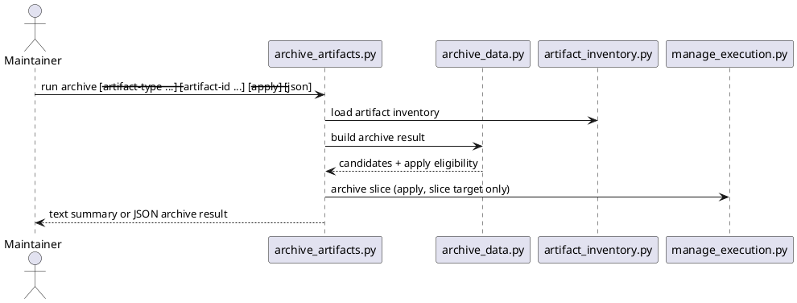

# Implementation Plan: Build the cross-artifact archive command

**Slice**: `CAM-05-safe-slice-archival`  
**Date**: 2026-04-11  
**Status**: Reviewed for close-slice  
**Spec**: `brief.md`

## 1. Summary

CAM-05 adds a conservative archive layer for durable workflow history. The slice
should reuse shared inventory for candidate discovery, support explicit apply
mode for one closed execution slice through the execution owner helper, and ship
an `archive-artifacts` skill and CLI with text and JSON output.

## 2. Technical Context

- Current system context:
  - proposal and subfeature metadata already expose statuses suitable for
    archive-candidate discovery
  - `skills/guide-execution/scripts/manage_execution.py` already supports slice
    archival
  - there is no repo-wide archive candidate view today
- Target modules / files:
  - `skills/archive-artifacts/SKILL.md`
  - `skills/archive-artifacts/scripts/archive_data.py`
  - `skills/archive-artifacts/scripts/archive_artifacts.py`
  - `skills/archive-artifacts/tests/test_archive_artifacts.py`
  - `Makefile`
  - `README.md`
- Constraints:
  - candidate discovery stays read-only
  - apply mode stays explicit and narrow in v1
  - proposal and subfeature candidates are reported only, not moved in v1
- Assumptions:
  - execution slices are the only archive writes with an existing owner helper
  - candidate discovery can still add value before other layers gain apply flows
- Out of scope:
  - bulk archival
  - proposal or subfeature move logic
  - implicit cleanup on closure

## 3. Planning Gates

### Architecture / Constraints

- Decision: separate read-only candidate discovery from narrow apply mode and
  delegate actual slice archival to the execution owner helper.
- Result: PASS
- Notes: this keeps v1 safe while still delivering a real archival workflow.

### Risk / Compliance

- Decision: reject unsupported non-slice apply requests clearly.
- Result: PASS
- Notes: the main risk is users assuming candidate discovery implies apply
  support for every artifact layer.

### Testability

- Decision: cover candidate discovery, unsupported apply requests, and closed
  slice archival in a targeted test module, then run `pytest -q`.
- Result: PASS
- Notes: fixture-driven tests can validate slice archival without depending on
  the real repo's slice state.

## 4. Requirement Traceability

| Requirement | Implementation Steps | Validation |
| --- | --- | --- |
| FR-001 | S001, S004, S007 | V001, V004 |
| FR-002 | S001, S002 | V001 |
| FR-003 | S003, S005 | V002, V003 |
| FR-004 | S005 | V003 |
| FR-005 | S004, S006 | V001, V004 |
| FR-006 | S003, S006 | V002 |

## 5. Execution Plan

### Packet P01: Build archive candidate discovery

- Scope: discover archive candidates from durable metadata and slice state.
- Target files:
  - `skills/archive-artifacts/scripts/archive_data.py`
  - `skills/archive-artifacts/tests/test_archive_artifacts.py`
- Dependencies: shared inventory and owner metadata readers
- Steps:
  - [x] S001 Discover proposal, subfeature, and slice artifacts from the shared
        inventory.
  - [x] S002 Classify archive candidates from durable statuses and closed-slice
        state.
  - [x] S003 Validate apply requests so only one closed slice target is allowed
        in v1.
- Validation:
  - [x] V001 `pytest -q skills/archive-artifacts/tests/test_archive_artifacts.py -k candidates`
- Definition of Done: one archive-result model powers candidate reporting and
  apply eligibility checks.
- Rollback / Mitigation: keep candidate discovery read-only and local to the new
  skill.

### Packet P02: Add the archive CLI and slice apply flow

- Scope: render candidate output and archive one closed slice through the
  execution owner helper.
- Target files:
  - `skills/archive-artifacts/scripts/archive_artifacts.py`
  - `skills/archive-artifacts/tests/test_archive_artifacts.py`
- Dependencies: P01
- Steps:
  - [x] S004 Render human-readable and JSON output from one archive result.
  - [x] S005 On a supported slice apply request, archive the target through
        `manage_execution.archive_slice(...)`.
  - [x] S006 Reject unsupported apply requests clearly.
- Validation:
  - [x] V002 `pytest -q skills/archive-artifacts/tests/test_archive_artifacts.py -k unsupported`
  - [x] V003 `pytest -q skills/archive-artifacts/tests/test_archive_artifacts.py -k apply`
- Definition of Done: maintainers can inspect archive candidates and archive one
  closed slice explicitly from the new command.
- Rollback / Mitigation: keep apply handling narrow and delegated to the owner
  helper.

### Packet P03: Ship the skill and repo wiring

- Scope: add the user-facing skill definition and managed install/docs wiring.
- Target files:
  - `skills/archive-artifacts/SKILL.md`
  - `Makefile`
  - `README.md`
- Dependencies: P02
- Steps:
  - [x] S007 Author `skills/archive-artifacts/SKILL.md` with candidate-report
        and slice-archive usage plus conservative guardrails.
  - [x] S008 Add `archive-artifacts` to the managed skill set and top-level repo
        guidance.
- Validation:
  - [x] V004 `pytest -q`
- Definition of Done: the archive capability is installed, documented, and
  validated in the managed skill set.
- Rollback / Mitigation: keep docs and install changes localized to the new
  skill.

## 6. Supporting Notes

### Detailed Design Diagrams (PlantUML)

- Diagram purpose: show how archive combines read-only candidate discovery with
  explicit slice archival through the owner helper.
- Diagram type: sequence

### Research Decisions

- Decision: treat proposal and subfeature archive support as candidate-only in
  v1.
- Rationale: those layers do not yet expose a narrow archive writer owned by
  their existing helpers.
- Alternative considered: move proposal or subfeature folders directly from this
  skill; rejected because it would bypass owner boundaries.

### Interface Notes

- Interface: `python3 skills/archive-artifacts/scripts/archive_artifacts.py`
- Inputs / outputs:
  - input: optional repeated `--artifact-type`, optional `--artifact-id`,
    optional `--apply`, optional `--json`
  - output: candidate summary by default, structured JSON when requested
- Error states / compatibility notes:
  - unsupported apply requests should fail clearly
  - slice apply requests must target a closed slice

### Verification Scenarios

- Happy path:
  - list current archive candidates
- Edge cases:
  - reject a proposal or subfeature apply request
  - archive one closed slice successfully
- Regression checks:
  - text and JSON output describe the same candidate set
  - `pytest -q` remains green

## 7. Delivery Notes

- Sequencing rationale: build candidate discovery first, then add the narrow
  slice apply flow, then expose the user-facing skill and install/docs wiring.
- Risks to monitor: implying unsupported archive writes for non-slice artifact
  layers, or accepting apply requests for slices that are not closed.
- Handoff notes for implementation: keep candidate discovery read-only, keep
  apply mode explicit, and let the execution owner helper perform the move.

## 8. Execution Review Outcome

- Outcome: ready for `close-slice`
- Review classification:
  - brief-to-implementation gap: none
  - intent-to-brief gap: none
  - follow-up outside the active slice: none
- Durable artifact note:
  - CAM-05 adds `skills/archive-artifacts/` as a conservative archive capability
    that reports candidates across relevant artifact layers and safely archives
    one closed slice at a time through the execution owner helper.
- Validation evidence:
  - `pytest -q skills/archive-artifacts/tests/test_archive_artifacts.py`
  - `pytest -q`
