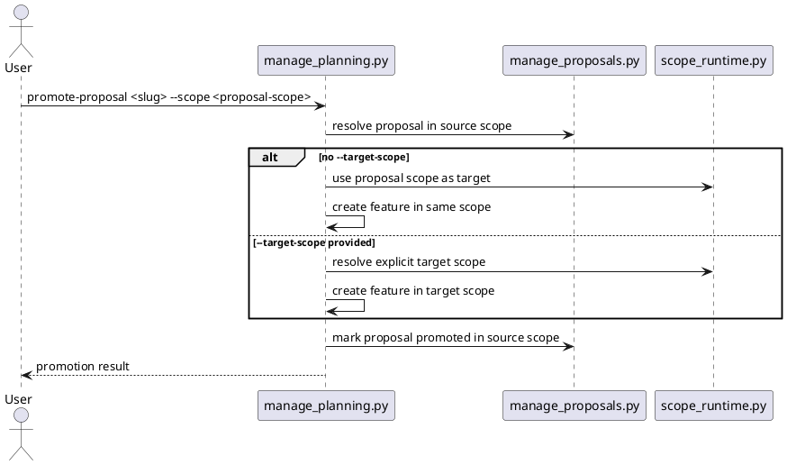

# Implementation Plan: Support explicit cross-scope promotion targets

**Slice**: `HSS-04-promotion-targeting-support-explicit-cross-scope-promotion-targets`  
**Date**: 2026-04-03  
**Status**: Reviewed for close-slice
**Spec**: `brief.md`

## 1. Summary

HSS-04 promotion targeting makes cross-scope proposal promotion explicit. The
current promotion flow already defaults to creating canonical feature planning in
the proposal’s own scope. This slice adds `--target-scope` so users can
deliberately create canonical planning in another valid scope, while invalid
target paths fail cleanly.

## 2. Technical Context

- Current system context:
  - `manage_planning.py promote_proposal_to_feature()` now uses the proposal’s
    resolved scope context, so same-scope promotion is already the default.
  - `promote-proposal` supports `--scope` for selecting the proposal source
    scope, but it does not yet allow an explicit target scope.
- Target modules / files:
  - `skills/guide-planning/scripts/manage_planning.py`
  - `skills/guide-planning/tests/test_manage_planning.py`
- Constraints:
  - keep same-scope promotion as the default
  - keep cross-scope promotion explicit through `--target-scope`
  - do not change generic ambiguity behavior from HSS-04-scope-selection
- Assumptions:
  - `--scope` identifies the proposal source scope when needed
  - `--target-scope` may point to the repository root or a nested child scope
- Out of scope:
  - config inheritance
  - scope-local execution
  - guide-scope routing

## 3. Planning Gates

### Architecture / Constraints

- Decision: add target-scope selection only to proposal promotion and reuse the
  existing shared scope runtime for validation.
- Result: PASS
- Notes: this keeps the slice tightly bounded to promotion routing instead of
  widening `--target-scope` into unrelated commands.

### Risk / Compliance

- Decision: preserve same-scope default and require explicit `--target-scope` for
  any cross-scope write.
- Result: PASS
- Notes: this avoids accidental canonical planning writes into parent or sibling
  scopes.

### Testability

- Decision: cover same-scope default, explicit cross-scope promotion, and invalid
  target-scope failure in the planning tests.
- Result: PASS
- Notes: one helper stack owns this behavior, so targeted planning tests plus the
  full repo suite are sufficient.

## 4. Requirement Traceability

| Requirement | Implementation Steps | Validation |
| --- | --- | --- |
| FR-001 | S001, S002 | V001, V002 |
| FR-002 | S001, S002 | V001, V002 |
| FR-003 | S002, S003 | V001, V002 |
| FR-004 | S001, S003 | V001, V002 |
| FR-005 | S001, S002 | V001, V002 |

## 5. Execution Plan

### Packet P01: Explicit promotion target support

- Scope: add `--target-scope` to proposal promotion and route canonical feature
  creation through the explicitly selected target scope when provided.
- Target files:
  - `skills/guide-planning/scripts/manage_planning.py`
- Dependencies: HSS-04-scope-selection
- Steps:
  - [ ] S001 Add `--target-scope` to the `promote-proposal` CLI contract and
        validate the path through the shared scope runtime.
  - [ ] S002 Keep same-scope promotion as the default by reusing the proposal
        scope when `--target-scope` is omitted.
  - [ ] S003 Use the resolved target scope when creating canonical feature
        planning and fail clearly for invalid target paths.
- Validation:
  - [ ] V001 `pytest -q skills/guide-planning/tests/test_manage_planning.py`
  - [ ] V002 `pytest -q`
- Definition of Done: proposal promotion writes canonical feature planning into
  the selected target scope only when `--target-scope` is explicitly provided.
- Rollback / Mitigation: keep same-scope promotion intact and remove only the
  new target-scope routing if the explicit targeting path is unstable.

## 6. Supporting Notes

### Detailed Design Diagrams (PlantUML)

- Diagram purpose: show the difference between same-scope default promotion and
  explicit cross-scope target promotion.
- Diagram type: sequence

### Research Decisions

- Decision: keep cross-scope promotion explicit through one additive flag on the
  promotion command.
- Rationale: the promotion flow is the only place in the planning layer that
  intentionally writes canonical planning into another scope.
- Alternative considered: infer the target scope from the current working
  directory; rejected because it would make cross-scope writes implicit.

### Interface Notes

- Interface: `promote-proposal --scope <source> [--target-scope <target>]`
- Inputs / outputs:
  - input: source proposal selector plus optional explicit target scope
  - output: canonical feature planning in the same scope by default, or in the
    selected target scope when provided
- Error states / compatibility notes:
  - invalid `--target-scope` paths must fail clearly
  - same-scope promotion remains backward compatible when `--target-scope` is omitted

### Verification Scenarios

- Happy path:
  - promote an accepted child-scope proposal without `--target-scope` and confirm
    canonical feature creation stays in the child scope
- Edge case:
  - promote the same proposal with `--target-scope` pointing at the repository
    root and confirm the canonical feature is created there instead
- Regression checks:
  - invalid target-scope path fails without creating the canonical feature
  - full `pytest -q` remains green

## 7. Delivery Notes

- Sequencing rationale: build explicit cross-scope promotion on top of the new
  `--scope` lookup contract before moving into config inheritance.
- Risks to monitor: accidentally creating the canonical feature in the source
  scope when a target scope is provided, or accepting a target path outside the
  repository.
- Handoff notes for implementation: keep the source-scope proposal update and the
  target-scope feature creation clearly separated so the promotion audit trail
  stays accurate.

## 8. Execution Review Outcome

- Outcome: ready for `close-slice`
- Review classification:
  - brief-to-implementation gap: none
  - intent-to-brief gap: none
  - follow-up outside the active slice: none
- Durable artifact note:
  - HSS-04 promotion targeting added explicit `--target-scope` handling while
    preserving same-scope promotion as the default path
- Validation evidence:
  - `pytest -q skills/guide-planning/tests/test_manage_planning.py`
  - `pytest -q`
