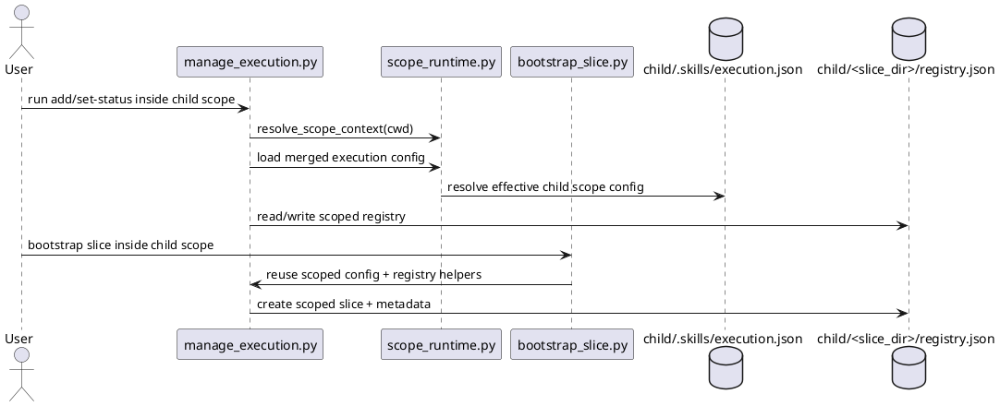

# Implementation Plan: Keep slices and execution registries local to the resolved scope

**Slice**: `HSS-06-scoped-execution-keep-slices-and-execution-registries-local-to-the-resolved-scope`  
**Date**: 2026-04-04  
**Status**: Reviewed
**Spec**: `brief.md`

## 1. Summary

HSS-06 scoped execution moves execution runtime state onto the resolved scope.
Guide-execution should stop reading and writing a single repository-root
registry, and `bootstrap_slice.py` should bootstrap against the same scoped
execution context. Parent config inheritance from HSS-06-config-inheritance stays
in place, but the new behavior change in this slice is where execution state is
stored and resolved.

## 2. Technical Context

- Current system context:
  - merged execution and conventions config can already be loaded for a resolved
    scope
  - guide-execution still defaults most operations to one repository-root
    `.skills/execution.json` and one registry path
  - `bootstrap_slice.py` still checks only `module.CONFIG_FILE` and does not
    reuse scoped registry helpers
- Target modules / files:
  - `skills/guide-execution/scripts/manage_execution.py`
  - `skills/slice/scripts/bootstrap_slice.py`
  - `skills/guide-execution/tests/test_manage_execution.py`
  - `skills/slice/tests/test_bootstrap_slice.py`
- Constraints:
  - keep root-scope behavior backward compatible
  - use the shared scope runtime rather than introducing a second scope model
  - rely on inherited execution config from HSS-06-config-inheritance when child
    scopes omit local `execution.json`
- Assumptions:
  - explicit nested execution scopes continue to be discovered through the shared
    planning-based scope runtime
  - no new CLI flags are needed for this slice; nearest-scope defaulting is
    sufficient
- Out of scope:
  - `guide-scope`
  - new planning/proposal ambiguity behavior
  - feature-level reconcile cleanup

## 3. Planning Gates

### Architecture / Constraints

- Decision: make guide-execution resolve a scope context up front, then use that
  context for config paths, registry paths, and slice creation.
- Result: PASS
- Notes: this keeps execution state ownership aligned with the same scope runtime
  already used by planning and proposals.

### Risk / Compliance

- Decision: preserve repository-root behavior as the fallback path and add
  regression tests for both inherited child execution config and default root
  execution.
- Result: PASS
- Notes: the main risk is accidentally hiding root slices or reinitializing child
  config unnecessarily when only inherited execution config exists.

### Testability

- Decision: add targeted nested-scope tests to guide-execution and bootstrap-slice
  suites, then run the repo suite.
- Result: PASS
- Notes: the slice is only complete when both direct execution commands and the
  bootstrap helper agree on the same scoped registry path.

## 4. Requirement Traceability

| Requirement | Implementation Steps | Validation |
| --- | --- | --- |
| FR-001 | S001, S002 | V001, V002 |
| FR-002 | S001, S002 | V001, V002 |
| FR-003 | S001, S003 | V001, V002 |
| FR-004 | S002, S003 | V001, V002 |
| FR-005 | S001, S002, S003 | V001, V002 |

## 5. Execution Plan

### Packet P01: Scoped execution paths in guide-execution

- Scope: make guide-execution resolve execution config and registry paths against
  the active scope root.
- Target files:
  - `skills/guide-execution/scripts/manage_execution.py`
  - `skills/guide-execution/tests/test_manage_execution.py`
- Dependencies: HSS-06-config-inheritance
- Steps:
  - [x] S001 Add shared helpers in `manage_execution.py` for resolving execution
        scope context, local config paths, and scoped registry paths before
        reading or writing registry state.
  - [x] S002 Update execution commands and registry helpers to operate on the
        scoped registry tree instead of one repository-root `slices/` location.
- Validation:
  - [x] V001 `pytest -q skills/guide-execution/tests/test_manage_execution.py`
- Definition of Done: guide-execution reads and writes slice metadata only inside
  the resolved execution scope.
- Rollback / Mitigation: keep scope resolution centralized and revert only the new
  default-scope path wiring if registry ownership becomes inconsistent.

### Packet P02: Scoped bootstrap integration

- Scope: make `bootstrap_slice.py` reuse the same scoped execution runtime.
- Target files:
  - `skills/slice/scripts/bootstrap_slice.py`
  - `skills/slice/tests/test_bootstrap_slice.py`
  - `skills/guide-execution/tests/test_manage_execution.py`
- Dependencies: P01
- Steps:
  - [x] S003 Update `bootstrap_slice.py` to reuse scoped execution config and
        registry helpers, including inherited child-scope config.
  - [x] S004 Add nested-scope regression coverage for local execution registries
        and inherited child-scope `slice_dir` resolution.
- Validation:
  - [x] V002 `pytest -q skills/guide-execution/tests/test_manage_execution.py skills/slice/tests/test_bootstrap_slice.py`
  - [x] V003 `pytest -q`
- Definition of Done: both guide-execution and bootstrap-slice create and manage
  slices in the resolved scope's local execution area.
- Rollback / Mitigation: preserve root fallback behavior in the new helpers so
  reverting scoped path resolution does not require undoing config inheritance.

## 6. Supporting Notes

### Detailed Design Diagrams (PlantUML)

- Diagram purpose: show how scoped execution commands and bootstrap resolve local
  registry paths through the shared scope runtime.
- Diagram type: sequence

### Research Decisions

- Decision: keep scope discovery inside guide-execution rather than threading a
  new `--scope` flag through every execution command.
- Rationale: HSS-03 and HSS-06-config-inheritance already established the
  nearest-scope runtime contract, so execution should follow the same defaulting
  model.
- Alternative considered: only make `bootstrap_slice.py` scoped and leave
  `manage_execution.py` root-bound; rejected because it would split registry
  ownership across two helpers.

### Interface Notes

- Interface: scope-aware execution config and registry helpers in
  `manage_execution.py`
- Inputs / outputs:
  - input: current working directory and optional inherited child-scope config
  - output: scope-local config path, registry path, and slice folder path
- Error states / compatibility notes:
  - missing child `execution.json` should fall back to inherited parent config
  - root behavior must still use repository-root `slices/` when no child scope
    applies
  - bootstrap should initialize local config only when no inherited execution
    config exists at all

### Verification Scenarios

- Happy path:
  - running execution commands from a child scope creates and updates slices only
    in the child scope registry
- Edge case:
  - a child scope with no local `execution.json` still uses an inherited
    `slice_dir`, resolved locally
- Regression checks:
  - root-scope execution commands still use the repository-root registry
  - full `pytest -q` remains green

## 7. Delivery Notes

- Sequencing rationale: land guide-execution scope ownership first, then reuse the
  same helpers in bootstrap-slice so the two entrypoints stay aligned.
- Risks to monitor: commands accidentally resolving selectors against the wrong
  registry, or child scopes creating a redundant local `execution.json` when
  inherited config should have been enough.
- Handoff notes for implementation: keep the new helpers additive and localized
  so HSS-05-guide-scope can later document execution handoff without revisiting
  registry ownership rules.

## 8. Execution Review Outcome

- Outcome: ready for `close-slice`
- Review classification:
  - brief-to-implementation gap: none
  - intent-to-brief gap: none
  - follow-up outside the active slice: none
- Durable artifact note:
  - HSS-06-scoped-execution now makes guide-execution resolve config and registry
    paths through the active scope context, stores slice rows as scope-local
    paths, and reuses the same scoped execution runtime in `bootstrap_slice.py`
    so inherited child-scope execution config works without forcing a local
    `execution.json`.
- Validation evidence:
  - `pytest -q skills/guide-execution/tests/test_manage_execution.py skills/slice/tests/test_bootstrap_slice.py`
  - `pytest -q`
