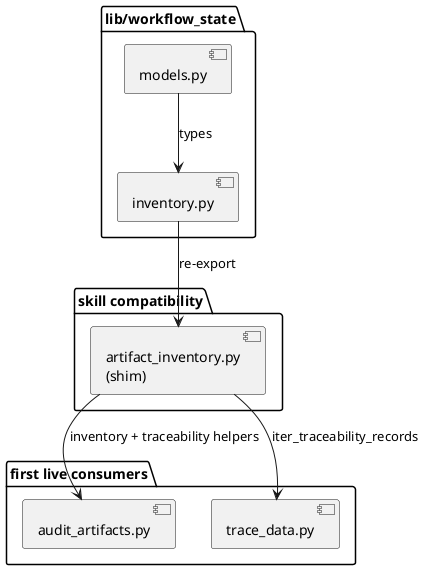

# Implementation Plan: Create shared workflow-state library

**Slice**: `WSC-02-shared-library`  
**Date**: 2026-04-17  
**Status**: Reviewed for close-slice  
**Spec**: `brief.md`

## 1. Summary

This slice establishes the first canonical `lib/workflow_state` package for
repo-local workflow-state semantics, then routes the existing audit and trace
flows through that shared package without changing write ownership or expanding
the feature into broader maintenance-skill adoption. The implementation stays
foundational: extract normalized models and inventory/traceability loading into
the shared library, keep `artifact_inventory.py` as a compatibility shim for
current callers, and preserve the existing audit/trace regression behavior.

## 2. Technical Context

- Current system context:
  - `skills/audit-artifacts/scripts/artifact_inventory.py` currently owns the
    normalized inventory context, registry discovery, and traceability parsing.
  - `skills/audit-artifacts/scripts/audit_artifacts.py` and
    `skills/trace-artifacts/scripts/trace_data.py` already depend on those
    semantics, directly or indirectly.
  - `skills/execute-all-slices/scripts/execute_all_slices.py` and
    `skills/repair-artifacts/scripts/repair_data.py` now also rely on the same
    parser path, so compatibility at the old import surface matters.
- Target modules / files:
  - `lib/workflow_state/__init__.py`
  - `lib/workflow_state/models.py`
  - `lib/workflow_state/inventory.py`
  - `skills/audit-artifacts/scripts/artifact_inventory.py`
  - `skills/audit-artifacts/scripts/audit_artifacts.py`
  - `skills/trace-artifacts/scripts/trace_data.py`
  - targeted regression tests under `skills/audit-artifacts/tests/` and
    `skills/trace-artifacts/tests/`
- Constraints:
  - preserve current read-only ownership boundaries for planning and execution
    metadata
  - keep existing CLI behavior stable for audit and trace workflows
  - do not absorb broader maintenance adoption, install/package sync, parity, or
    transition-owner changes from later planned slices
- Assumptions:
  - the shared-library slice can prove value with audit and trace flows only,
    while other maintenance consumers keep using the compatibility shim until
    later slices move them deliberately
  - existing audit/trace regression fixtures are sufficient to validate the
    extracted semantics
- Out of scope:
  - install/package sync work for self-contained skill copies
  - repair/report adoption
  - transition-owner guardrails
  - parity and CI validation hooks

## 3. Planning Gates

### Architecture / Constraints

- Decision: Extract the canonical inventory and traceability semantics into
  `lib/workflow_state`, but retain `artifact_inventory.py` as a thin
  compatibility layer so current callers do not break mid-feature.
- Result: PASS
- Notes: This matches the reviewed feature design while keeping this slice
  focused on the foundational library packet only.

### Risk / Compliance

- Decision: Keep the new library read-only and preserve existing owner scripts
  for all planning/execution metadata writes.
- Result: PASS
- Notes: No new configuration surfaces, network behavior, or data-retention
  concerns are introduced in this slice.

### Testability

- Decision: Reuse existing audit and trace regression suites, plus add a focused
  shared-library regression check if needed for the extracted import surface.
- Result: PASS
- Notes: The validation path stays deterministic and already covers the stale
  linkage behavior that motivated the feature.

## 4. Requirement Traceability

| Requirement | Implementation Steps | Validation |
| --- | --- | --- |
| FR-001 | S001, S002 | V001, V002 |
| FR-002 | S002, S003 | V001, V002 |
| FR-003 | S003, S004 | V001, V002 |
| FR-004 | S001, S003 | V001 |
| FR-005 | S004 | V001, V002 |

## 5. Execution Plan

### Packet P01: Extract canonical workflow-state library

- Scope: Create the repo-local shared package for workflow-state models and
  inventory/traceability loading.
- Target files:
  - `lib/workflow_state/__init__.py`
  - `lib/workflow_state/models.py`
  - `lib/workflow_state/inventory.py`
- Dependencies: none
- Steps:
  - [ ] S001 Move the normalized dataclasses and inventory-context types out of
        `artifact_inventory.py` into `lib/workflow_state/models.py`.
  - [ ] S002 Move inventory discovery, registry loading, and traceability
        parsing into `lib/workflow_state/inventory.py`, preserving current
        behavior for missing files and malformed metadata.
  - [ ] S003 Export the shared package API through `lib/workflow_state/__init__.py`
        so consumers can import canonical inventory and traceability helpers
        without reaching into skill-specific modules.
- Validation:
  - [ ] V001 Run `pytest -q skills/audit-artifacts/tests/test_audit_artifacts.py
        skills/trace-artifacts/tests/test_trace_artifacts.py`
- Definition of Done: the canonical `lib/workflow_state` package exists and
  exposes the inventory/traceability semantics currently owned by
  `artifact_inventory.py`.
- Rollback / Mitigation: keep the skill-local compatibility module intact until
  consumer imports have been verified against the shared package.

### Packet P02: Preserve compatibility and route first consumers through the library

- Scope: Keep existing callers stable while making audit/trace semantics resolve
  from the shared library.
- Target files:
  - `skills/audit-artifacts/scripts/artifact_inventory.py`
  - `skills/audit-artifacts/scripts/audit_artifacts.py`
  - `skills/trace-artifacts/scripts/trace_data.py`
- Dependencies: P01
- Steps:
  - [ ] S004 Convert `artifact_inventory.py` into a compatibility shim that
        imports and re-exports the shared library surface from `lib/workflow_state`.
  - [ ] S005 Update audit and trace code paths to consume the shared inventory
        and traceability helpers directly where that clarifies ownership, while
        keeping compatibility imports valid for other unchanged consumers.
  - [ ] S006 Ensure the shared library import path works when scripts are run
        from the repository root with the current CLI entrypoints.
- Validation:
  - [ ] V002 Run `pytest -q skills/audit-artifacts/tests/test_audit_artifacts.py
        skills/trace-artifacts/tests/test_trace_artifacts.py`
- Definition of Done: audit and trace workflows are backed by the shared
  library, and existing callers that still import `artifact_inventory.py`
  continue to work.
- Rollback / Mitigation: if direct consumer imports introduce fragile path
  handling, leave them on the compatibility shim and keep the shim as the single
  routed entry for this slice.

### Packet P03: Lock the extracted semantics with regression coverage

- Scope: Ensure the extracted library preserves the motivating stale-state
  behavior and does not regress traceability interpretation.
- Target files:
  - `skills/audit-artifacts/tests/test_audit_artifacts.py`
  - `skills/trace-artifacts/tests/test_trace_artifacts.py`
  - optional focused regression test near the new shared library if direct
    coverage is still missing
- Dependencies: P01, P02
- Steps:
  - [ ] S007 Add or adjust regression coverage so the shared library path is
        exercised in both audit and trace workflows.
  - [ ] S008 Confirm the motivating subfeature/traceability linkage behavior
        still resolves identically after extraction.
- Validation:
  - [ ] V003 Run `pytest -q skills/audit-artifacts/tests/test_audit_artifacts.py
        skills/trace-artifacts/tests/test_trace_artifacts.py`
- Definition of Done: the shared-library extraction is covered by regression
  tests that fail if callers drift away from the canonical inventory semantics.
- Rollback / Mitigation: if coverage reveals an incompatible extraction shape,
  keep the library API smaller and reintroduce only the minimum compatibility
  bridge necessary to preserve behavior.

## 6. Supporting Notes

### Detailed Design Diagrams (PlantUML)

- Diagram purpose: show the slice-scoped extraction boundary and the intended
  compatibility bridge for existing callers.
- Diagram type: component

### Research Decisions

- Decision: keep `artifact_inventory.py` as the first compatibility bridge
- Rationale: multiple current callers already import that module, so removing it
  in the same slice would widen the change beyond the foundational library goal
- Alternative considered: update every current consumer to import
  `lib/workflow_state` directly in one slice

### Interface Notes

- Interface: `lib/workflow_state.inventory`
- Inputs / outputs:
  - inputs: repository-root artifact paths, current planning/execution/proposal
    registries, traceability markdown files
  - outputs: normalized inventory rows and `TraceabilityRecord` collections
- Error states / compatibility notes:
  - malformed metadata should continue to surface explicit reader errors
  - missing traceability files should continue to produce empty record sets
  - compatibility shim exports must remain import-compatible for unchanged
    callers such as `repair-artifacts` and `execute-all-slices`

### Verification Scenarios

- Happy path: audit and trace workflows load the same feature/subfeature/slice
  linkage through the shared library without changing their user-facing results
- Edge case: a missing `slice-traceability.md` still returns no records instead
  of failing open or inventing linkage
- Regression checks: the concrete stale-state coverage added in the earlier
  audit work remains green after extraction

## 7. Delivery Notes

- Sequencing rationale: extract the canonical package first, preserve
  compatibility second, then tighten regression coverage so later slices can
  adopt the shared library without re-litigating the foundational semantics.
- Risks to monitor:
  - Python import-path breakage when running scripts directly from the repo root
  - accidental widening into repair/report adoption or install/package sync work
  - loss of behavior in the existing audit/trace stale-state regressions
- Handoff notes for implementation:
  - prefer a thin compatibility shim over broad consumer rewrites
  - keep owner-boundary semantics explicit and read-only
  - stop once the shared library is real, audit/trace run through it, and the
    targeted tests are green

## 8. Execution Review Outcome

- Outcome: ready for `close-slice`
- Review classification:
  - brief-to-implementation gap: none
  - intent-to-brief gap: none
  - follow-up outside the active slice:
    - `WSC-02-maintenance-adoption` should move the broader maintenance consumers
      and managed install/package sync onto the shared library after this
      foundational extraction
- Durable artifact note:
  - `WSC-02-shared-library` establishes `lib/workflow_state/` as the canonical
    home for workflow-state models and inventory/traceability loading while
    preserving the existing read-only ownership boundaries through the
    compatibility shim in `skills/audit-artifacts/scripts/artifact_inventory.py`.
- Validation evidence:
  - `pytest -q skills/audit-artifacts/tests/test_audit_artifacts.py skills/trace-artifacts/tests/test_trace_artifacts.py`
