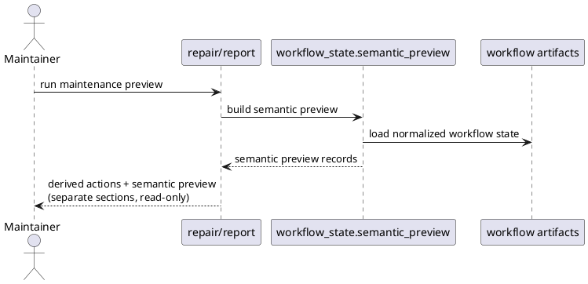

# Implementation Plan: Add preview-only semantic drift reporting

**Slice**: `WSC-03-semantic-preview`  
**Date**: 2026-04-19  
**Status**: Reviewed for close-slice  
**Spec**: `brief.md`

## 1. Summary

This slice turns the existing preview-only semantic repair suggestions into an
explicit shared semantic-preview contract and surfaces that contract through
both repair and report outputs. The goal is not to add a metadata write path;
it is to separate high-confidence semantic drift from derived registry/readme
rebuild work so maintainers can review semantic issues safely and later
transition checks can reuse the same finding shape.

## 2. Technical Context

- Current system context:
  - `skills/repair-artifacts/scripts/repair_data.py` already computes
    preview-only suggestions for proposal links, planning status handoff, and
    traceability execution IDs, but those suggestions are still repair-local and
    are rendered generically as `Suggestions`.
  - `skills/report-artifacts/scripts/report_data.py` currently reports durable
    workflow records and metrics, but it does not surface any semantic preview
    findings.
  - The shared `workflow_state` runtime now exists and is synced into the
    maintenance skill folders, so repair and report can share one semantic
    preview helper without reintroducing cross-skill packaging drift.
  - Later planned work (`WSC-01-transition-guardrails`) depends on one stable
    semantic finding shape before owner scripts warn or block on those findings.
- Target modules / files:
  - `lib/workflow_state/` shared runtime (new semantic preview helper and
    exports)
  - synced maintenance runtime copies under `skills/repair-artifacts/lib/` and
    `skills/report-artifacts/lib/`
  - `skills/repair-artifacts/scripts/repair_data.py`
  - `skills/repair-artifacts/scripts/repair_artifacts.py`
  - `skills/report-artifacts/scripts/report_data.py`
  - `skills/report-artifacts/scripts/report_artifacts.py`
  - targeted tests under `skills/repair-artifacts/tests/` and
    `skills/report-artifacts/tests/`
- Constraints:
  - keep the semantic path read-only; no apply-mode mutation of metadata should
    be added in this slice
  - preserve derived registry/readme repair behavior and keep it distinct from
    semantic preview output
  - avoid widening into transition enforcement, parity reporting, or new config
    surfaces
  - keep the semantic preview contract structured enough for later reuse
- Assumptions:
  - the existing repair suggestion builders capture the first set of
    high-confidence semantic findings worth previewing
  - report output can surface the same semantic preview records without needing
    to mutate or regroup the existing durable artifact records
  - extending the shared runtime with a read-only semantic-preview helper is
    within slice scope because it prevents repair/report drift and supports
    later guardrails
- Out of scope:
  - owner-mediated metadata repair commands
  - transition-time blocking or warning behavior
  - installed-vs-repo parity inspection
  - CI validation hooks

## 3. Planning Gates

### Architecture / Constraints

- Decision: Extract the semantic preview builders into the shared
  `workflow_state` runtime, then make repair and report consume that shared
  contract while keeping repair `actions` and semantic preview findings
  explicitly separate.
- Result: PASS
- Notes: This gives repair and report the same read-only finding shape and keeps
  the next transition-guardrail slice from re-inventing the contract.

### Risk / Compliance

- Decision: Keep the new semantic preview path read-only and continue limiting
  `--apply` to deterministic derived registry/readme rebuilds.
- Result: PASS
- Notes: The main risk is accidental confusion between preview and mutation, so
  both JSON and text outputs should label the semantic path explicitly.

### Testability

- Decision: Reuse the repair and report suites, adding focused assertions for
  semantic preview fields and text rendering.
- Result: PASS
- Notes: The validation path stays narrow and deterministic because the
  underlying drift fixtures already exist in repair/report tests.

## 4. Requirement Traceability

| Requirement | Implementation Steps | Validation |
| --- | --- | --- |
| FR-001 | S001, S003 | V001, V002 |
| FR-002 | S001, S002 | V001 |
| FR-003 | S001, S003, S004 | V001, V002 |
| FR-004 | S001, S003 | V001, V002 |
| FR-005 | S004 | V001, V002 |

## 5. Execution Plan

### Packet P01: Promote semantic preview into the shared runtime

- Scope: Extract the current repair-only semantic suggestion builders into a
  reusable shared helper with explicit structured output.
- Target files:
  - `lib/workflow_state/models.py`
  - new shared helper under `lib/workflow_state/`
  - `lib/workflow_state/__init__.py`
  - synced maintenance runtime copies under `skills/repair-artifacts/lib/` and
    `skills/report-artifacts/lib/`
- Dependencies: `WSC-02-maintenance-adoption`
- Steps:
  - [x] S001 Define a shared semantic preview record shape and helper that builds
        the current high-confidence preview findings from normalized workflow
        inventory.
  - [x] S002 Keep the helper explicitly read-only and suitable for later
        transition reuse by not coupling it to repair `apply` behavior.
- Validation:
  - [x] V001 Run `pytest -q skills/repair-artifacts/tests/test_repair_artifacts.py skills/report-artifacts/tests/test_report_artifacts.py`
- Definition of Done: Repair and report can both import one shared semantic
  preview builder from the synced `workflow_state` runtime.
- Rollback / Mitigation: If the shared helper shape becomes too broad, keep the
  initial helper small and limited to the existing high-confidence preview
  records already proven by repair tests.

### Packet P02: Separate semantic preview from derived repair in repair output

- Scope: Make repair results and text rendering label semantic preview findings
  distinctly from derived registry/readme rebuild actions.
- Target files:
  - `skills/repair-artifacts/scripts/repair_data.py`
  - `skills/repair-artifacts/scripts/repair_artifacts.py`
- Dependencies: P01
- Steps:
  - [x] S003 Replace repair-local suggestion building with the shared semantic
        preview helper and expose an explicit semantic-preview section or summary
        in repair results.
  - [x] S004 Update text rendering so maintainers can clearly tell which output
        is derived rebuild work and which output is read-only semantic preview.
- Validation:
  - [x] V002 Run `pytest -q skills/repair-artifacts/tests/test_repair_artifacts.py`
- Definition of Done: Repair preview output separates semantic drift from
  derived rebuild work without changing apply-mode ownership.
- Rollback / Mitigation: If result-shape changes become too disruptive, keep the
  old fields as compatibility aliases while adding the explicit semantic-preview
  fields needed by this slice.

### Packet P03: Surface the same semantic preview contract through report output

- Scope: Add read-only semantic preview reporting to `report-artifacts` using
  the same shared preview records as repair.
- Target files:
  - `skills/report-artifacts/scripts/report_data.py`
  - `skills/report-artifacts/scripts/report_artifacts.py`
  - `skills/report-artifacts/tests/test_report_artifacts.py`
- Dependencies: P01
- Steps:
  - [x] S005 Extend report result data with semantic preview findings derived
        from the shared helper while keeping the existing durable artifact record
        report intact.
  - [x] S006 Update report text rendering to show semantic preview output as a
        distinct read-only section instead of folding it into the artifact record
        list.
- Validation:
  - [x] V003 Run `pytest -q skills/report-artifacts/tests/test_report_artifacts.py`
- Definition of Done: Report output exposes the same read-only semantic preview
  findings that repair exposes, separately from the durable artifact records.
- Rollback / Mitigation: If full record-level embedding is noisy, keep the
  semantic preview at report-summary scope while preserving the shared record
  payload for future guardrail reuse.

### Packet P04: Lock the preview contract with regression coverage

- Scope: Add focused tests that prove both consumers share the same semantic
  preview contract and keep it separate from derived work.
- Target files:
  - `skills/repair-artifacts/tests/test_repair_artifacts.py`
  - `skills/report-artifacts/tests/test_report_artifacts.py`
- Dependencies: P01, P02, P03
- Steps:
  - [x] S007 Extend repair tests to assert the new explicit semantic preview
        shape and the continued read-only apply boundary.
  - [x] S008 Extend report tests to assert the semantic preview payload and text
        rendering without regressing the existing record/metrics reporting path.
- Validation:
  - [x] V004 Run `pytest -q skills/repair-artifacts/tests/test_repair_artifacts.py skills/report-artifacts/tests/test_report_artifacts.py`
- Definition of Done: Repair and report tests fail if semantic preview drifts
  apart or becomes conflated with derived rebuild behavior.
- Rollback / Mitigation: If one consumer needs an extra compatibility field,
  document it explicitly and keep the shared preview record as the source of
  truth for future slices.

## 6. Supporting Notes

### Detailed Design Diagrams (PlantUML)

- Diagram purpose: show the read-only semantic preview helper feeding both
  repair and report while keeping derived rebuild actions separate.
- Diagram type: sequence

### Research Decisions

- Decision: move semantic preview record building into the shared runtime now
- Rationale: repair already contains the initial logic, but report and later
  transition guardrails need the same finding shape without another local fork
- Alternative considered: keep repair-local suggestion builders and duplicate
  them in report

### Data Model Notes

- Entity: semantic preview record
- Fields / relationships:
  - artifact type / artifact id / path
  - stable preview code
  - human-readable message
  - apply-supported flag (false for this slice)
- Validation rules:
  - preview records must stay read-only and serializable for both JSON and text
    output

### Interface Notes

- Interface: shared semantic preview helper under `workflow_state`
- Inputs / outputs:
  - inputs: normalized workflow inventory and selected artifact types
  - outputs: structured semantic preview records plus preview counts
- Error states / compatibility notes:
  - malformed metadata should continue surfacing as explicit failures, not
    preview records
  - existing repair result fields may need compatibility aliases if callers
    already consume `suggestions`

### Verification Scenarios

- Happy path: repair and report both show the same semantic preview records
  separately from derived actions and durable record listings
- Edge case: a repo with only derived registry/readme drift shows no semantic
  preview records
- Regression checks: apply-mode behavior remains limited to derived rebuild
  actions even when semantic preview records exist

## 7. Delivery Notes

- Sequencing rationale: extract the shared semantic preview contract first, then
  update repair and report to render it separately, then lock it with tests.
- Risks to monitor:
  - breaking existing repair/report JSON consumers by removing legacy fields too
    aggressively
  - accidentally broadening semantic preview into a write path
  - coupling report output too tightly to repair-specific presentation details
- Handoff notes for implementation:
  - keep semantic preview explicitly read-only
  - preserve compatibility where practical while adding clearer output names
  - prefer one shared preview record shape that later transition checks can
    reuse directly

## 8. Execution Review Outcome

- Outcome: ready for `close-slice`
- Review classification:
  - brief-to-implementation gap: none
  - intent-to-brief gap: none
  - follow-up improvement outside the active slice:
    - `WSC-01-transition-guardrails` should reuse the shared
      `workflow_state.semantic_preview` contract rather than redefining semantic
      drift checks inside owner scripts
