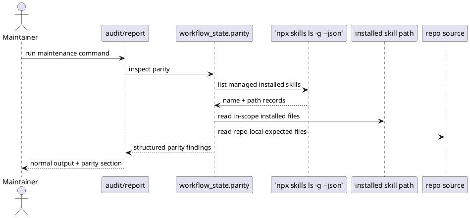

# Implementation Plan: Surface installed-vs-repo skill parity drift

**Slice**: `WSC-04-installed-parity`  
**Date**: 2026-04-19  
**Status**: Draft  
**Spec**: `brief.md`

## 1. Summary

This slice adds one shared installed-vs-repo parity inspection path to
`workflow_state` and surfaces that parity through the existing audit and report
maintenance outputs. The goal is to make stale installed maintenance-skill
behavior visible before maintainers trust a result, without adding a new
standalone parity command or mutating installed copies automatically.

## 2. Technical Context

- Current system context:
  - The repository now keeps a canonical shared workflow-state runtime under
    `lib/workflow_state/` and syncs that runtime into the maintenance and owner
    skill folders before `make install`.
  - The managed install path already uses `npx skills add`, and `npx skills ls
    -g --json` exposes installed skill names plus their on-disk paths.
  - `audit-artifacts` already reports structured findings and `report-artifacts`
    already exposes summary-oriented read-only state, so parity can land in
    existing output surfaces rather than a new command.
  - `report-artifacts` already surfaces semantic preview findings separately,
    which provides a model for keeping parity findings explicit and read-only.
- Target modules / files:
  - new `lib/workflow_state/parity.py`
  - `lib/workflow_state/models.py` and `lib/workflow_state/__init__.py` if the
    shared runtime needs explicit parity record exports
  - synced maintenance runtime copies under:
    - `skills/audit-artifacts/lib/workflow_state/`
    - `skills/report-artifacts/lib/workflow_state/`
    - other synced consumers refreshed through `scripts/sync_shared_skill_runtime.py`
  - maintenance entrypoints:
    - `skills/audit-artifacts/scripts/audit_artifacts.py`
    - `skills/report-artifacts/scripts/report_data.py`
    - `skills/report-artifacts/scripts/report_artifacts.py`
  - targeted tests:
    - `skills/audit-artifacts/tests/test_audit_artifacts.py`
    - `skills/report-artifacts/tests/test_report_artifacts.py`
  - `Makefile` only if the parity implementation needs a small install-validation
    hook to keep managed install behavior explicit
- Constraints:
  - keep parity read-only; do not mutate installed skills or repo files
  - preserve the current managed install flow and avoid introducing a new parity
    command in the first rollout
  - keep parity results structured so audit/report can render them differently
    without re-deriving mismatch logic
  - tolerate missing or stale installed copies without breaking normal repo-local
    maintenance behavior
  - compare only the reviewed in-scope maintenance skill surfaces for this slice
- Assumptions:
  - `npx skills ls -g --json` is the right source of truth for active installed
    managed skill locations in this environment because it returns skill names
    and installation paths directly
  - the first rollout should focus on the maintenance skills a repo owner would
    trust before using repair/audit output, rather than every skill in the
    managed set
  - parity findings should be warnings/read-only signals in maintenance output,
    not a replacement for install/update workflows
- Out of scope:
  - a dedicated parity-only CLI
  - automatic reinstallation or repair of stale installed skills
  - parity checks for non-maintenance skills
  - CI validation hooks beyond the parity-aware maintenance outputs in this slice

## 3. Planning Gates

### Architecture / Constraints

- Decision: Add a shared `workflow_state.parity` helper that discovers installed
  managed skill paths from `npx skills ls -g --json`, compares the in-scope
  installed runtime files against repo-local expectations, and returns structured
  mismatch records for audit/report consumers.
- Result: PASS
- Notes: This keeps parity semantics centralized and reuses the managed install
  contract the repo already documents instead of hardcoding a private filesystem
  layout.

### Risk / Compliance

- Decision: Keep parity findings read-only and surface them as structured warning
  records through audit/report output without broadening ownership into install
  mutation.
- Result: PASS
- Notes: The main risk is false positives from unstable or partial install
  layouts, so the initial comparison set should stay narrow and file-based.

### Testability

- Decision: Extend the existing audit/report suites with a controlled stale-install
  fixture that mimics `npx skills ls -g --json` output and a mismatched installed
  skill path.
- Result: PASS
- Notes: The tests can stub the installed skill listing and create temporary
  copied skill roots, which keeps parity verification deterministic without
  depending on the real global agent install.

## 4. Requirement Traceability

| Requirement | Implementation Steps | Validation |
| --- | --- | --- |
| FR-001 | S001, S003, S005 | V001, V002 |
| FR-002 | S001, S003, S004, S005 | V001, V002 |
| FR-003 | S001, S004 | V001, V002 |
| FR-004 | S002, S003, S005 | V001, V002 |
| FR-005 | S006, S007 | V001, V002, V003 |

## 5. Execution Plan

### Packet P01: Create the shared parity inspection runtime

- Scope: Add the shared installed-vs-repo comparison helper and export its record
  shape from `workflow_state`.
- Target files:
  - new `lib/workflow_state/parity.py`
  - `lib/workflow_state/models.py`
  - `lib/workflow_state/__init__.py`
  - synced runtime copies refreshed via `scripts/sync_shared_skill_runtime.py`
- Dependencies: `WSC-02-shared-library`
- Steps:
  - [x] S001 Define the shared parity record shape and helper that discovers the
        active installed maintenance-skill paths from `npx skills ls -g --json`
        and compares them to repo-local expectations.
  - [x] S002 Keep the comparison set narrow and low-noise by focusing on the
        reviewed in-scope maintenance skill surfaces and explicit file
        mismatches/missing files.
- Validation:
  - [x] V001 Run `pytest -q skills/audit-artifacts/tests/test_audit_artifacts.py skills/report-artifacts/tests/test_report_artifacts.py`
- Definition of Done: Audit/report consumers can import one shared parity helper
  and receive structured installed-vs-repo mismatch records.
- Rollback / Mitigation: If install discovery is too environment-sensitive, keep
  the helper injectable so tests and future callers can supply a resolved
  installed skill listing explicitly.

### Packet P02: Surface parity through audit output

- Scope: Add parity findings to `audit-artifacts` so stale installed behavior is
  visible in the structured maintenance audit.
- Target files:
  - `skills/audit-artifacts/scripts/audit_artifacts.py`
  - `skills/audit-artifacts/tests/test_audit_artifacts.py`
- Dependencies: P01
- Steps:
  - [x] S003 Feed shared parity findings into the audit result as a distinct
        category/severity path rather than ad hoc audit-local messages.
  - [x] S004 Preserve read-only behavior and existing audit ownership boundaries
        so parity findings warn about stale installs without attempting repairs.
- Validation:
  - [x] V002 Run `pytest -q skills/audit-artifacts/tests/test_audit_artifacts.py`
- Definition of Done: Audit output reports stale installed maintenance-skill
  copies as explicit structured findings while clean parity stays quiet.
- Rollback / Mitigation: If parity findings make audit output too noisy, keep the
  shared records but narrow the default rendered summary to only actual
  mismatches.

### Packet P03: Surface the same parity records through report output

- Scope: Extend report summaries/text with installed-vs-repo parity visibility
  using the same shared parity records as audit.
- Target files:
  - `skills/report-artifacts/scripts/report_data.py`
  - `skills/report-artifacts/scripts/report_artifacts.py`
  - `skills/report-artifacts/tests/test_report_artifacts.py`
- Dependencies: P01
- Steps:
  - [x] S005 Extend report results with parity findings and summary counts while
        preserving the existing artifact-record and semantic-preview paths.
  - [x] S006 Render parity findings as a separate read-only section so
        maintainers can distinguish stale installs from workflow artifact drift.
- Validation:
  - [x] V003 Run `pytest -q skills/report-artifacts/tests/test_report_artifacts.py`
- Definition of Done: Report output surfaces the same parity records as audit,
  separately from artifact records and semantic preview findings.
- Rollback / Mitigation: If full parity detail is too verbose in report text,
  keep the shared records in JSON and reduce the text renderer to a count plus
  the first few mismatches.

### Packet P04: Lock parity behavior with stale-install regression coverage

- Scope: Add deterministic fixtures for clean and stale installed-skill parity
  scenarios.
- Target files:
  - `skills/audit-artifacts/tests/test_audit_artifacts.py`
  - `skills/report-artifacts/tests/test_report_artifacts.py`
  - `Makefile` only if a tiny verification hook meaningfully improves the stale
    install scenario or maintainer reruns
- Dependencies: P02, P03
- Steps:
  - [x] S007 Add a temporary installed-skill fixture or injected installed-skill
        listing that simulates one stale managed maintenance-skill copy.
  - [x] S008 Add clean-parity assertions so unchanged installed copies do not
        emit mismatch output.
- Validation:
  - [x] V004 Run `pytest -q skills/audit-artifacts/tests/test_audit_artifacts.py skills/report-artifacts/tests/test_report_artifacts.py`
- Definition of Done: The parity fixture proves both stale and clean outcomes
  deterministically through the targeted maintenance suites.
- Rollback / Mitigation: If a full Makefile hook is unnecessary, keep validation
  entirely inside the targeted tests and document the runtime discovery contract
  in code comments where needed.

## 6. Supporting Notes

### Detailed Design Diagrams (PlantUML)

- Diagram purpose: show audit/report consumers reusing one shared installed-vs-repo
  parity helper based on the managed installed skill listing.
- Diagram type: sequence

### Research Decisions

- Decision: discover installed skill paths through `npx skills ls -g --json`
  instead of assuming one hardcoded global directory
- Rationale: the managed install path already depends on the `skills` CLI and
  exposes both skill names and paths in a machine-readable form
- Alternative considered: compare only repo-local vendored skill copies

### Data Model Notes

- Entity: parity finding
- Fields / relationships:
  - skill name
  - compared file path
  - mismatch type (`missing`, `content_mismatch`, or similar)
  - installed path and repo path context
  - human-readable message
- Validation rules:
  - parity findings must stay serializable and reusable across audit/report
  - clean parity should return zero findings for unchanged installs

### Interface Notes

- Interface: `workflow_state.parity`
- Inputs / outputs:
  - inputs: optional installed skill listing override plus default managed skill
    discovery through `npx skills ls -g --json`
  - outputs: structured parity records and summary counts
- Error states / compatibility notes:
  - failure to inspect the installed skill listing should surface explicitly to
    the caller rather than being disguised as a clean parity result
  - missing installed skills can be represented as parity findings when that is
    more useful than a hard command failure for audit/report callers

### Verification Scenarios

- Happy path: installed maintenance skills match the repo source and parity
  output remains empty
- Edge case: one installed skill-local runtime file is stale or missing and the
  output surfaces the specific mismatch
- Regression checks: parity findings remain distinct from audit validation
  findings and from report semantic-preview findings

## 7. Delivery Notes

- Sequencing rationale: create the shared parity helper first, then wire audit,
  then wire report, then lock the behavior with deterministic stale-install
  fixtures.
- Risks to monitor:
  - environment-specific install discovery that makes parity noisy or brittle
  - over-reporting differences that are not meaningful behavior drift
  - conflating parity findings with semantic workflow drift in report output
- Handoff notes for implementation:
  - keep parity discovery injectable for tests and future callers
  - prefer structured records over freeform strings so audit/report stay aligned
  - keep the first rollout inside existing maintenance outputs rather than adding
    a new parity-only command

## 8. Execution Review Outcome

- Outcome: ready for `close-slice`
- Review classification:
  - brief-to-implementation gap: none
  - intent-to-brief gap: none
  - follow-up improvement outside the active slice:
    - `WSC-05-validation-hooks` should call the shared
      `workflow_state.inspect_installed_skill_parity` helper instead of
      re-deriving installed-vs-repo file comparisons in its validation hook path
