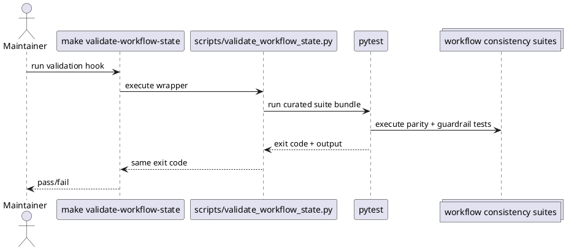

# Implementation Plan: Add repeatable workflow consistency validation hooks

**Slice**: `WSC-05-validation-hooks`  
**Date**: 2026-04-19  
**Status**: Draft  
**Spec**: `brief.md`

## 1. Summary

This slice adds one repeatable repo-level workflow consistency validation
entrypoint for CI and maintainer reruns. The implementation will wrap the
reviewed workflow-state regression suites behind a small top-level validation
script plus a Makefile target, then lock that hook under test so the curated
suite list does not silently drift.

## 2. Technical Context

- Current system context:
  - The repository already has deterministic workflow-state regression coverage
    for the shared audit/report parity paths and the owner-side transition
    guardrails.
  - `WSC-04-installed-parity` added a shared parity helper and clean/stale
    installed-copy fixtures, while `WSC-01-transition-guardrails` stabilized
    guide-planning and close-slice guardrail coverage.
  - The remaining gap is operational: maintainers and CI still need to remember
    the curated validation command sequence manually.
- Target modules / files:
  - new `scripts/validate_workflow_state.py`
  - `Makefile`
  - `README.md`
  - `skills/audit-artifacts/tests/test_audit_artifacts.py`
  - `skills/report-artifacts/tests/test_report_artifacts.py`
- Constraints:
  - keep the validation hook read-only; it should only run existing regression
    suites and surface their exit status
  - preserve existing pytest-based coverage instead of duplicating fixture logic
    in a second validation implementation
  - make the hook stable for CI and maintainers by keeping the curated test list
    explicit in one place
  - keep the first rollout lightweight; no background services, no new CI
    provider-specific configuration, and no automatic install repair
- Assumptions:
  - the reviewed workflow consistency signal for this slice is the curated pytest
    bundle already called out in `slice-planning.md`
  - a top-level script plus a Makefile target is the right maintainer-facing
    surface for a repeatable validation hook in this repository
- Out of scope:
  - bespoke CI YAML changes
  - a second validation implementation that replays fixture setup outside pytest
  - expanding the curated suite list beyond the reviewed workflow-state tests

## 3. Planning Gates

### Architecture / Constraints

- Decision: Add a small top-level Python wrapper that executes the reviewed
  workflow-state pytest bundle from the repo root, then expose it through a
  dedicated Makefile target.
- Result: PASS
- Notes: This gives CI and maintainers one stable entrypoint while keeping the
  source-of-truth assertions inside the existing tests.

### Risk / Compliance

- Decision: Keep the validation hook read-only and subprocess-based so it only
  reruns existing tests and returns their exit status.
- Result: PASS
- Notes: The main risk is silent drift in the curated suite list, so the hook
  itself should have regression coverage.

### Testability

- Decision: Add focused tests in the existing audit/report suites that validate
  the hook’s command construction and exit-code passthrough, then run the
  reviewed workflow-state suites plus the full repo suite.
- Result: PASS
- Notes: This keeps the hook implementation under test without adding a separate
  standalone test file outside the reviewed validation command.

## 4. Requirement Traceability

| Requirement | Implementation Steps | Validation |
| --- | --- | --- |
| FR-001 | S001, S002 | V001, V002 |
| FR-002 | S001, S003 | V001, V002 |
| FR-003 | S001, S004 | V001, V002 |
| FR-004 | S001, S004 | V001, V002 |
| FR-005 | S002, S003 | V001, V002 |

## 5. Execution Plan

### Packet P01: Create the repeatable validation hook surface

- Scope: Add the repo-level validation wrapper and expose it through the normal
  maintainer surfaces.
- Target files:
  - new `scripts/validate_workflow_state.py`
  - `Makefile`
  - `README.md`
- Dependencies: `WSC-01-transition-guardrails`, `WSC-04-installed-parity`
- Steps:
  - [x] S001 Add a small validation wrapper that runs the reviewed workflow
        consistency pytest bundle from the repo root and returns the underlying
        exit status unchanged.
  - [x] S002 Expose that wrapper through a dedicated Makefile target so CI and
        maintainers can rerun the hook with one documented command.
  - [x] S003 Update the repo-level maintainer guidance to point at the new
        validation entrypoint.
- Validation:
  - [x] V001 Run `python3 scripts/validate_workflow_state.py`
- Definition of Done: The repository has one documented command surface for the
  curated workflow consistency validation bundle.
- Rollback / Mitigation: If the wrapper proves unnecessary, keep the curated
  pytest bundle in one Makefile target and leave the script as a thin internal
  helper rather than removing the stable entrypoint.

### Packet P02: Lock the validation hook under regression coverage

- Scope: Add deterministic coverage so the hook’s curated suite list and exit
  behavior do not drift silently.
- Target files:
  - `skills/audit-artifacts/tests/test_audit_artifacts.py`
  - `skills/report-artifacts/tests/test_report_artifacts.py`
- Dependencies: P01
- Steps:
  - [x] S004 Add a focused test that asserts the validation hook targets the
        reviewed workflow consistency suites explicitly.
  - [x] S005 Add a focused test that asserts the validation hook runs from the
        repo root and propagates pytest failures correctly.
- Validation:
  - [x] V002 Run `pytest -q skills/audit-artifacts/tests/test_audit_artifacts.py skills/report-artifacts/tests/test_report_artifacts.py skills/guide-planning/tests/test_manage_planning.py skills/close-slice/tests/test_close_slice.py`
- Definition of Done: The validation hook stays discoverable, deterministic, and
  tied to the reviewed workflow consistency bundle.
- Rollback / Mitigation: If testing the full hook is too brittle, narrow the
  tests to command construction and exit-code passthrough while the real suites
  remain the primary validation source.

## 6. Supporting Notes

### Detailed Design Diagrams (PlantUML)

- Diagram purpose: show the repo-level validation entrypoint delegating to the
  curated workflow consistency pytest bundle.
- Diagram type: sequence

### Research Decisions

- Decision: keep the validation hook pytest-backed instead of re-implementing
  the fixture logic in a separate audit/report command runner
- Rationale: the reviewed drift cases already live in deterministic regression
  suites, and duplicating them would add maintenance risk without new coverage
- Alternative considered: add a dedicated maintenance CLI that recreates the
  fixture repos outside pytest

### Data Model Notes

- Entity: workflow consistency validation bundle
- Fields / relationships:
  - repo root working directory
  - explicit ordered pytest path list
  - process exit code passthrough
- Validation rules:
  - the bundle list must stay explicit and deterministic
  - the hook must not mutate repo or installed-skill state

### Interface Notes

- Interface: `scripts/validate_workflow_state.py`
- Inputs / outputs:
  - inputs: optional passthrough pytest arguments after `--`
  - outputs: process exit code and streamed pytest output
- Error states / compatibility notes:
  - subprocess execution failures should fail explicitly rather than returning a
    success-shaped default
  - the hook should always run from the repo root so relative test paths stay
    stable in CI and maintainer shells

### Verification Scenarios

- Happy path: the curated workflow consistency suites pass and the hook exits 0
- Edge case: one suite fails and the hook returns the same non-zero exit code
- Regression checks: the hook’s curated suite list remains aligned with the
  reviewed audit/report/planning/closure coverage

## 7. Delivery Notes

- Sequencing rationale: create the hook surface first, then add regression
  coverage around the hook itself, then validate the curated suite bundle and
  the full repository.
- Risks to monitor:
  - silent drift between the hook’s curated suite list and the reviewed planning
  - overengineering the hook beyond a thin, stable wrapper
  - obscuring the underlying pytest failure by adding too much wrapper logic
- Handoff notes for implementation:
  - prefer a single explicit source of truth for the curated suite list
  - document the new target where maintainers already look for Makefile-based
    repo operations
  - keep the hook read-only and small enough that future slices can extend it
    safely if CI needs grow

## 8. Execution Review Outcome

- Outcome: ready for `close-slice`
- Review classification:
  - brief-to-implementation gap: none
  - intent-to-brief gap: none
  - follow-up improvement outside the active slice:
    - if the repository later wants provider-specific CI wiring, add that in a
      follow-on change without widening `scripts/validate_workflow_state.py`
      beyond its current thin wrapper role
