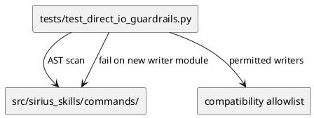

# Implementation Plan: Add AST-based Direct I/O Guardrail Test

**Slice**: `dalc-foundation-guardrail`  
**Date**: 2026-06-25  
**Status**: Draft  
**Spec**: `brief.md`

## 1. Summary

Add a pytest guardrail that scans command modules with Python AST and reports new direct workspace-write patterns outside the current compatibility allowlist.

The test is intentionally additive: it protects future DAL migration work without forcing the remaining writer modules to move in the same slice.

## 2. Technical Context

- Current system context:
  - command modules still own several direct workspace write paths
  - the new shared `lib/workflow_state` runtime foundation is already in place
  - later slices will migrate metadata and markdown ownership out of commands
- Target modules / files:
  - `tests/test_direct_io_guardrails.py`
  - optionally `tests/test_remaining_command_wrappers.py` for a compatibility assertion if needed
- Constraints:
  - the guardrail must pass on the current repository state
  - no runtime behavior should change
  - the test must be deterministic and repo-local
- Assumptions:
  - a static AST scan is enough to catch the regression class for this slice
  - a compatibility allowlist is acceptable until the later repository slices narrow it
- Out of scope:
  - migrating actual write ownership out of command modules
  - changing CLI behavior
  - adding runtime validation hooks

## 3. Planning Gates

### Architecture / Constraints

- Decision: implement the guardrail as a pytest AST scan over `src/sirius_skills/commands/` with an explicit allowlist of currently accepted writer modules.
- Result: PASS
- Notes: This gives a deterministic regression barrier without blocking the remaining staged refactors.

### Risk / Compliance

- Decision: keep the guardrail read-only and local to the test suite.
- Result: PASS
- Notes: No new configuration, persistence, or external dependencies are introduced.

### Testability

- Decision: make the guardrail fail only when an unapproved command module introduces a direct workspace write.
- Result: PASS
- Notes: The pass/fail boundary is easy to verify under pytest.

## 4. Requirement Traceability

| Requirement | Implementation Steps | Validation |
| --- | --- | --- |
| FR-001 | S001 | V001 |
| FR-002 | S001 | V001 |
| FR-003 | S001 | V001 |
| FR-004 | S001 | V001 |

## 5. Execution Plan

### Packet P01: Add the AST guardrail test

- Scope: create the regression test and its compatibility allowlist.
- Target files:
  - `tests/test_direct_io_guardrails.py`
- Dependencies: foundation-storage slice complete
- Steps:
  - [ ] S001 Add a deterministic AST-based scan that flags new direct workspace-write patterns in command modules outside the current allowlist.
- Validation:
  - [ ] V001 Run `pytest tests/test_direct_io_guardrails.py`
- Definition of Done: the test passes on the current tree and fails for a synthetic unapproved writer module.
- Rollback / Mitigation: if the scan is too broad, narrow it to write-specific primitives rather than generic file access.

## 6. Supporting Notes

### Detailed Design Diagrams (PlantUML)

- Diagram purpose: show the test-only guardrail boundary between the command tree and the regression scanner.
- Diagram type: component

### Verification Scenarios

- Happy path: the current command tree passes because existing writer modules are explicitly allowlisted.
- Edge case: a new command module with a direct `open(..., "w")` or `Path.write_text(...)` call fails the scan.
- Regression checks: read-only command modules are not flagged.

## 7. Delivery Notes

- Sequencing rationale: land the guardrail now so later metadata and markdown migrations have a fixed regression harness.
- Risks to monitor:
  - the allowlist being too broad or too narrow
  - false positives from non-workspace writes or test helpers
- Handoff notes for implementation:
  - keep the scan focused on write primitives
  - keep the allowlist explicit and easy to tighten later
  - prefer a single test module over multiple overlapping checks

