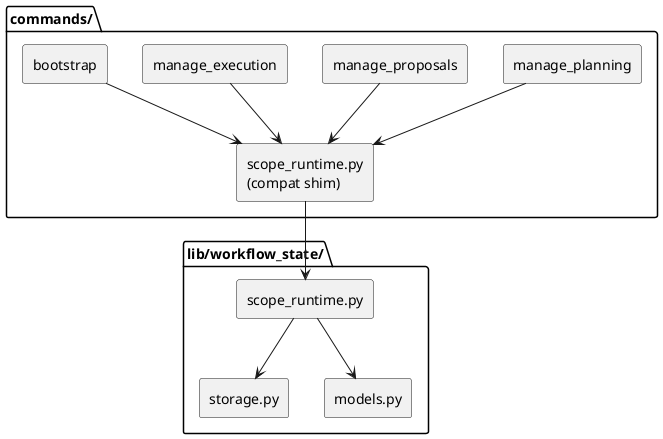

# Implementation Plan: Implement Storage/Models and Relocate Scope Runtime

**Slice**: `dalc-foundation-storage`  
**Date**: 2026-06-25  
**Status**: Draft  
**Spec**: `brief.md`

## 1. Summary

Create the shared workflow-state foundation package by introducing common storage helpers, keeping shared model types in the library package, and relocating the scope runtime implementation into `lib/workflow_state/` while preserving the current `commands/scope_runtime.py` import surface as a compatibility shim.

This slice is intentionally foundational: it establishes the shared boundary that later metadata, guardrail, and markdown repository slices will use, but it does not migrate those later repositories yet.

## 2. Technical Context

- Current system context:
  - `src/sirius_skills/commands/scope_runtime.py` owns `ScopeContext`, scope discovery, merged config loading, and scope-path resolution.
  - `manage_planning.py`, `manage_proposals.py`, `manage_execution.py`, and `bootstrap.py` import that module from `sirius_skills.commands`.
  - `src/sirius_skills/lib/workflow_state/` already exists as the canonical home for shared workflow-state code, but it does not yet own scope runtime or generic storage helpers.
- Target modules / files:
  - `src/sirius_skills/lib/workflow_state/storage.py`
  - `src/sirius_skills/lib/workflow_state/models.py`
  - `src/sirius_skills/lib/workflow_state/scope_runtime.py`
  - `src/sirius_skills/lib/workflow_state/__init__.py`
  - `src/sirius_skills/commands/scope_runtime.py`
  - `tests/test_scope_runtime.py`
  - `tests/test_cli.py` or `tests/test_remaining_command_wrappers.py` for compatibility coverage if needed
- Constraints:
  - preserve current CLI behavior and scope resolution semantics
  - keep the public import path for existing callers stable during the move
  - do not start migrating the metadata repositories in this slice
  - do not add new config surfaces
- Assumptions:
  - a thin compatibility shim is acceptable for the existing command import path while the canonical implementation moves into `lib/workflow_state`
  - storage helpers can be generic and read/write oriented without owning any feature-specific repository logic yet
- Out of scope:
  - planning/proposal/execution repository migrations
  - direct call-site rewrites across all command modules
  - the direct-I/O guardrail slice

## 3. Planning Gates

### Architecture / Constraints

- Decision: relocate the real scope runtime into `lib/workflow_state/`, add shared storage helpers there, and keep `commands/scope_runtime.py` as a forwarding compatibility shim.
- Result: PASS
- Notes: This keeps the shared boundary explicit without forcing the rest of the repo to migrate imports in the same slice.

### Risk / Compliance

- Decision: preserve read-only scope resolution behavior and keep file I/O helpers local to the repository filesystem only.
- Result: PASS
- Notes: No new external integrations, credentials, or environment-controlled paths are introduced.

### Testability

- Decision: add direct tests for the relocated runtime and the compatibility import path.
- Result: PASS
- Notes: The slice has a clear regression target: behavior before and after the move must remain identical.

## 4. Requirement Traceability

| Requirement | Implementation Steps | Validation |
| --- | --- | --- |
| FR-001 | S001 | V001 |
| FR-002 | S001 | V001 |
| FR-003 | S002, S003 | V002 |
| FR-004 | S002 | V002 |
| FR-005 | S002, S003 | V002, V003 |

## 5. Execution Plan

### Packet P01: Add shared storage and model foundation

- Scope: introduce the reusable storage helper and any shared typed model helpers needed by the relocated runtime.
- Target files:
  - `src/sirius_skills/lib/workflow_state/storage.py`
  - `src/sirius_skills/lib/workflow_state/models.py`
  - `src/sirius_skills/lib/workflow_state/__init__.py`
- Dependencies: none
- Steps:
  - [ ] S001 Add the shared storage helper API for JSON and text file reads/writes, with explicit JSON-shape validation and path-safe persistence behavior.
  - [ ] S002 Add or export the shared model types needed by the relocated runtime and future workflow-state repositories, and surface them from the package root.
- Validation:
  - [ ] V001 Add focused unit coverage for the storage helper round-trip and error handling.
- Definition of Done: the workflow-state package has a reusable storage boundary and a clear shared-model export surface.
- Rollback / Mitigation: if a helper proves too broad, keep the exported API minimal and move specialized behavior into later repository modules.

### Packet P02: Relocate scope runtime with compatibility shim

- Scope: move the canonical scope runtime implementation into `lib/workflow_state/` without breaking existing callers.
- Target files:
  - `src/sirius_skills/lib/workflow_state/scope_runtime.py`
  - `src/sirius_skills/commands/scope_runtime.py`
- Dependencies: P01
- Steps:
  - [ ] S003 Move the scope resolution logic, `ScopeContext`, merged-config loading, and scope-path helpers into the library-owned module.
  - [ ] S004 Replace the command-local module with a thin compatibility shim that re-exports the new library module so existing imports continue to work.
- Validation:
  - [ ] V002 Add direct tests for `resolve_scope_context`, nested scope selection, and config merging from the new library path.
  - [ ] V003 Verify that existing command imports still resolve through the shim without changing observed behavior.
- Definition of Done: the canonical runtime lives under `lib/workflow_state/`, and current callers still work.
- Rollback / Mitigation: if import churn becomes risky, keep the shim authoritative until the later command-migration slices land.

### Packet P03: Lock the foundation with regression coverage

- Scope: prove that the relocated runtime behaves identically and that the compatibility import path remains valid.
- Target files:
  - `tests/test_scope_runtime.py`
  - optionally `tests/test_cli.py` or `tests/test_remaining_command_wrappers.py`
- Dependencies: P02
- Steps:
  - [ ] S005 Add tests for nested planning scope resolution, repo-root fallback, and merged config loading through the relocated runtime.
  - [ ] S006 Add a compatibility test that imports the runtime through the old command path and confirms the same observable behavior.
- Validation:
  - [ ] V004 Run `pytest tests/test_scope_runtime.py tests/test_cli.py`
- Definition of Done: the new foundation has regression coverage for the move and the old import surface.
- Rollback / Mitigation: if the new test file proves too broad, keep the runtime-specific cases isolated and narrow the assertions to path and config behavior.

## 6. Supporting Notes

### Detailed Design Diagrams (PlantUML)

- Diagram purpose: show the slice boundary between command callers, the compatibility shim, and the new library-owned runtime/storage/model foundation.
- Diagram type: component

### Verification Scenarios

- Happy path: existing command code can keep resolving scope through the old import path while the canonical implementation lives in the library package.
- Edge case: a nested child scope still resolves against the nearest planning config root, not the repository root.
- Regression checks: malformed config and missing file behavior remain explicit and unchanged.

## 7. Delivery Notes

- Sequencing rationale: land storage/model helpers first, move the runtime second, then add regression coverage so the compatibility bridge remains safe to remove later.
- Risks to monitor:
  - import-path breakage from the module relocation
  - accidentally widening into later repository migrations
  - behavior drift in nested-scope resolution or config merging
- Handoff notes for implementation:
  - keep the compatibility shim thin
  - avoid changing command callers unless the move requires a narrow import adjustment
  - preserve existing error text and path normalization semantics wherever practical

