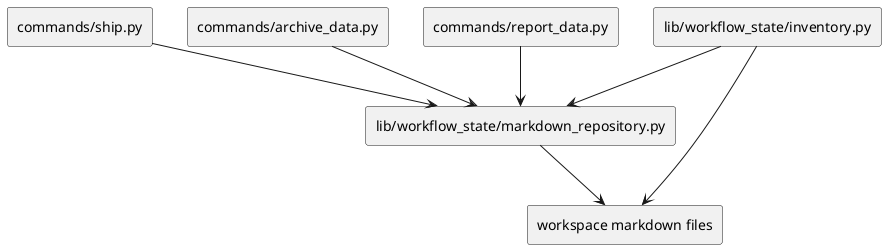

# Implementation Plan: Implement Markdown and Artifact Repositories

**Slice**: `dalc-repo-markdown`  
**Date**: 2026-06-25  
**Status**: Draft  
**Spec**: `brief.md`

## 1. Summary

Move markdown parsing, traceability table handling, and archive-summary write helpers out of the command layer and into shared markdown/artifact repository helpers.

## 2. Technical Context

- Current system context:
  - metadata repository modules already centralize registry and metadata JSON access
  - inventory/owner-completion already consume shared workflow-state helpers
  - ship/archive/report paths still own some markdown parsing and write helpers
- Target modules / files:
  - `src/sirius_skills/lib/workflow_state/markdown_repository.py`
  - `src/sirius_skills/lib/workflow_state/inventory.py`
  - `src/sirius_skills/commands/ship.py`
  - `src/sirius_skills/commands/archive_data.py`
  - `src/sirius_skills/commands/report_data.py`
- Constraints:
  - preserve current markdown table and appendix formats
  - keep the code local and deterministic
  - do not introduce a second artifact model
- Assumptions:
  - the existing traceability and archive-summary formats are stable enough to codify in helpers
  - command-level orchestration can continue to call into the shared repository helpers
- Out of scope:
  - changing archive policy or reconciliation semantics
  - altering the metadata repository APIs from the prior slice
  - adding new user-facing flags or formats

## 3. Planning Gates

### Architecture / Constraints

- Decision: centralize markdown table parsing and markdown summary/appendix writing in a shared repository module, then thin the command callers.
- Result: PASS
- Notes: This keeps markdown-specific logic out of orchestration modules without changing the output format.

### Risk / Compliance

- Decision: preserve the existing traceability and archive-summary markdown layouts exactly.
- Result: PASS
- Notes: That minimizes churn in feature/subfeature planning artifacts.

### Testability

- Decision: add repository tests for traceability parsing and markdown write helpers plus command smoke tests.
- Result: PASS
- Notes: The work can be verified via targeted pytest runs.

## 4. Requirement Traceability

| Requirement | Implementation Steps | Validation |
| --- | --- | --- |
| FR-001 | S001 | V001 |
| FR-002 | S001, S002 | V001 |
| FR-003 | S002 | V001 |
| FR-004 | S002 | V001 |
| FR-005 | S001 | V001 |

## 5. Execution Plan

### Packet P01: Add the markdown repository helpers

- Scope: create the shared markdown repository module and move the parsing/writing helpers into it.
- Target files:
  - `src/sirius_skills/lib/workflow_state/markdown_repository.py`
  - `src/sirius_skills/lib/workflow_state/inventory.py`
- Dependencies: metadata repositories complete
- Steps:
  - [ ] S001 Add shared markdown parsing and markdown write helpers for traceability and archive summaries.
  - [ ] S002 Update ship/archive/report/inventory callers to use the shared helpers.
- Validation:
  - [ ] V001 Run pytest across the touched markdown and command paths.
- Definition of Done: the shared markdown repository owns the moved logic and the command workflows still pass.
- Rollback / Mitigation: if a helper becomes too broad, split it by concern (traceability, reconciliation, archive summaries) without changing the public behavior.

## 6. Supporting Notes

### Detailed Design Diagrams (PlantUML)

- Diagram purpose: show the command-to-markdown repository boundary.
- Diagram type: component

### Verification Scenarios

- Happy path: traceability tables parse through the shared helper and produce the same records as before.
- Edge case: archive summary blocks in `system-design.md` remain discoverable and writable.
- Regression checks: ship/archive/report workflows still operate on the same markdown files and output the same high-level behavior.

## 7. Delivery Notes

- Sequencing rationale: this is the final consolidation slice, so it should finish the remaining markdown-centric helpers after metadata ownership has been moved.
- Risks to monitor:
  - duplication between inventory and markdown repository helpers
  - regressions in markdown formatting or summary-block delimiters
  - accidental behavioral changes in archive or ship reconciliation paths
- Handoff notes for implementation:
  - keep the markdown module focused on parsing/writing concerns
  - reuse existing inventory models instead of inventing new artifact types
  - keep the command layer as thin orchestration over the shared helpers

