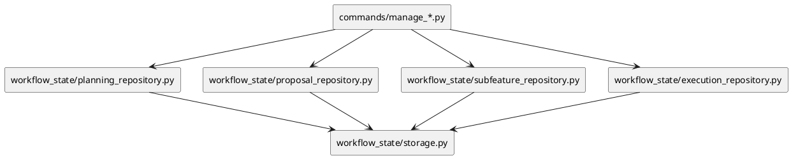

# Implementation Plan: Implement Registry and Metadata Repositories

**Slice**: `dalc-repo-metadata`  
**Date**: 2026-06-25  
**Status**: Draft  
**Spec**: `brief.md`

## 1. Summary

Move the current registry and metadata file access out of the planning/proposal/subfeature/execution command modules and into shared repository modules under `src/sirius_skills/lib/workflow_state/`.

## 2. Technical Context

- Current system context:
  - `storage.py` already provides shared text/JSON write helpers
  - `scope_runtime.py` and `models.py` already own the shared boundary types
  - `inventory.py` and `owner_completion.py` already consume the shared workflow-state layer
- Target modules / files:
  - `src/sirius_skills/lib/workflow_state/planning_repository.py`
  - `src/sirius_skills/lib/workflow_state/proposal_repository.py`
  - `src/sirius_skills/lib/workflow_state/subfeature_repository.py`
  - `src/sirius_skills/lib/workflow_state/execution_repository.py`
  - the corresponding `commands/manage_*.py` modules
- Constraints:
  - preserve existing file formats and CLI behavior
  - keep the repository APIs deterministic and filesystem-local
  - avoid introducing a new config surface
- Assumptions:
  - the command helper logic can be split into domain-specific repository modules
  - current JSON and markdown registry projections stay as-is
- Out of scope:
  - markdown repository consolidation
  - changing feature/proposal/subfeature schemas
  - altering the slice guardrail allowlist in this slice

## 3. Planning Gates

### Architecture / Constraints

- Decision: implement domain-specific repository modules for planning, proposal, subfeature, and execution metadata/registry access.
- Result: PASS
- Notes: This keeps each artifact family explicit without forcing one monolithic DAL module.

### Risk / Compliance

- Decision: preserve the existing CLI entrypoints and artifact formats while moving the data access boundary.
- Result: PASS
- Notes: That limits the migration to ownership changes rather than behavior changes.

### Testability

- Decision: use focused repository tests plus a broad pytest run over the touched command paths.
- Result: PASS
- Notes: The slice should be verifiable from repository-level helpers and the existing CLI workflows.

## 4. Requirement Traceability

| Requirement | Implementation Steps | Validation |
| --- | --- | --- |
| FR-001 | S001, S002 | V001 |
| FR-002 | S001, S002 | V001 |
| FR-003 | S002 | V001 |
| FR-004 | S002 | V001 |
| FR-005 | S001 | V001 |

## 5. Execution Plan

### Packet P01: Add shared metadata repository modules

- Scope: create the shared library modules for each artifact family.
- Target files:
  - `src/sirius_skills/lib/workflow_state/planning_repository.py`
  - `src/sirius_skills/lib/workflow_state/proposal_repository.py`
  - `src/sirius_skills/lib/workflow_state/subfeature_repository.py`
  - `src/sirius_skills/lib/workflow_state/execution_repository.py`
- Dependencies: storage + scope-runtime foundation complete
- Steps:
  - [ ] S001 Move or centralize the registry/metadata read-write logic into the new repository modules.
  - [ ] S002 Update command modules to use the new repository helpers for the moved data-access paths.
- Validation:
  - [ ] V001 Run pytest across the touched command and repository paths.
- Definition of Done: commands still work and the repository modules own the moved data access.
- Rollback / Mitigation: if a module becomes too large, keep the behavior split by artifact family and thin the commands incrementally.

## 6. Supporting Notes

### Detailed Design Diagrams (PlantUML)

- Diagram purpose: show the repository boundary between CLI commands and the metadata repositories.
- Diagram type: component

### Verification Scenarios

- Happy path: commands can read and write existing planning/proposal/subfeature/execution metadata through the new repository modules.
- Edge case: malformed registry JSON still fails fast at the repository boundary.
- Regression checks: CLI status transitions and owner-completion flows still behave the same.

## 7. Delivery Notes

- Sequencing rationale: land the metadata repositories before markdown consolidation so the later slice can thin the remaining file-format code.
- Risks to monitor:
  - duplicated normalization during transition
  - command modules that still own helper functions after the move
  - tests that accidentally overfit the old helper locations
- Handoff notes for implementation:
  - keep the repository APIs small and domain-specific
  - prefer moving functions intact over rewriting behavior
  - update imports in commands once the new repository APIs are stable

